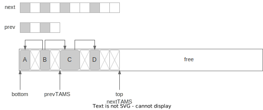
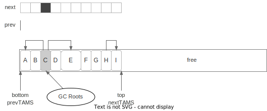
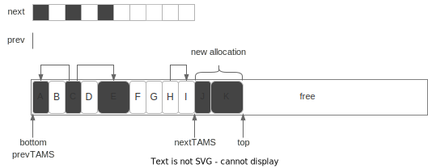
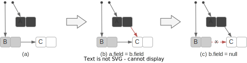
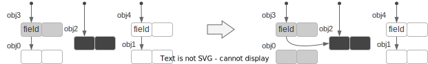
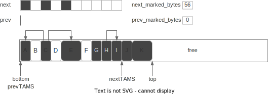
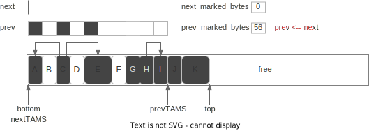

# 并发标记

本章比较长，请耐心阅读。主要介绍并发标记算法的各个步骤和细节。

## 什么是并发标记

前面我们提到 `垃圾回收 = 识别 + 回收`，并发标记就是识别的部分，需要识别出内存
里有哪些对象还存活，哪些对象已经没用了，可以回收。

### 标记与 GC Roots

首先有一部分对象我们会认为肯定还活着，一般称为 GC Roots，例如线程堆栈上的变量，
如传入方法的参数，创建的临时变量等；例如系统加载的一些类等等[^ref-gc-roots]。

已知 GC Roots 必不可能是垃圾，那么从 GC Roots 引用的对象，必不可能是垃圾。因此
并发标记中的“标记”，本质上就是从 GC Roots 出发，递归遍历所有引用的对象，把它们
标记为“live（存活）”，这样没有标记到的就是垃圾，可以被清除。

### 标记与三色算法

标记本质是在做树/森林的遍历，遍历每一个“可达”的对象，遍历过程中有三个状态，为
了方便讨论，通常用三种颜色对应三个状态：

- Black（黑）: 对象被访问了，且对象发出的引用都加入遍历队列。之后标记程序不会再访问该对象
- Grey（灰）: 对象被加入了遍历队列，但还没有被标记程序访问。标记程序之后会访问它
- White（白）: 标记程序还没有感知到它的存在，可能是还没遍历到，也可能是它本身不可触达

在下面的讨论中我们会用这些概念来讨论一些扫描机制的边界条件，但记住颜色的说法只
是方便讨论遍历中节点的不同状态而已。下面再来张图方便直观理解遍历过程：


细节实现上，上图展示的是宽度搜索，但标记本身并不依赖具体的实现。G1 的实现有点
像是宽搜和深搜的复合版本，以平衡效率和空间占用。实现的方式可以参考论文《A
generational mostly-concurrent garbage collector》。

## 并发与 SATB

上一章提过 GC 算法的其中一个目标是减少停顿[^comment-pause]，这里的停顿指的是应
用程序的停顿。但像标记的工作，要扫描的存活对象客观上就有那么多，可能就算砸锅卖
铁也需要那么长的时间，怎么减少停顿？其中一个想法是“并发”
[^comment-parallel-vs-concurrency]，应用程序工作的同时，拿部分资源做 GC 的事，
而不需要将应用程序暂停。

那么代价呢？
- GC 吞吐变差。如果完全停顿，GC 可以砸锅卖铁用所有资源，现在单位时间内只能用部
  分资源，GC 的吞吐必然变差
- GC 实现更复杂。例如三色算法，考虑的是“静态”的引用树，但在并发模式下，标记到
   一半时，树的结构可能发生变化，于是算法得有相关的实现来处理这些情况。

吞吐问题是效率问题，基本只能靠不断优化算法与实现细节。引用结构变化问题是正确性
问题，目前有多种解法，G1GC 采用的是 Snapshot At The Beginning(SATB) 的解法
[^ref-incremental-update]。核心思想是：标记开始前对当前的引用树做个快照，本次
标记只对快照负责，对快照后变为垃圾的对象视而不见（这些垃圾也被称为浮动垃圾
floating garbage，会在下次 GC 时被回收）。

## 标记位图

要把对象标记成“存活”或“垃圾”，这个标记放哪？

我们知道 Java 的每个对象有对象头（object header），一种想法是在对象头里拿一个
bit 来记录这个信息，但这种做法从各种角度都不太好，如需要访问的内存散落各处，对
缓存不友好；难以处理并发访问的一些情况；创建子进程时对内存的修改会触发操作系统
的 Copy on Write 机制，容易浪费内存。

G1GC 使用的是标记位图，可以类比成为现实世界创建一张地图，标记的时候只在地图上
标记，可以解决上面说的相关问题。位图需要占用额外的内存，但大小有限，例如每个对
象大小是 8 字节，一个对象只需要 1 bit 标记，于是标记位图大小只需要内存的1/64
即可。

另外，要实现上面提到的 SATB 快照也需要额外记录一些信息，因此 G1 实际上需要记录
这么一些内容：



`bottom` 指针指向区域的开始，`top` 指向区域内空闲空间的开始。`prev` 和`next`
代表的是标记位图。额外地还有 TAMS(Top at marking start) 指针，记录的是标记开始
时 `top` 的值，也分 prevTAMS, nextTAMS 两个版本，是实现 SATB 快照用的。

注意到位图和 TAMS 都有 prev 和 next 两个版本，这里 prev 版本是上一次标记的结果，
而 next 版本记录的是本次进行中的状态[^ref-single-bitmap]。`TAMS` 作用是做 SATB
的快照，对引用树做快照肯定不能复制一份内存，G1 的做法是在标记开始时将 `top` 值
记录为 `nextTAMS`，本次标记只处理 `[bottom, nextTAMS]` 之间的对象，同样地回收
时只回收 `[bottom, prevTAMS)` 间的对象[^comment-prevTAMS]。由于 mutator 并发执
行，标记过程中如果创建新对象，`top`指针会增加，而在 `[TAMS, top]` 之间的对象，
都当作是存活的对象。

## 并发标记整体步骤

注意下文介绍的步骤和《深入 Java 虚拟机》一书里介绍的不一样，这里采用了 [Oracle 教程](https://www.oracle.com/technetwork/tutorials/tutorials-1876574.html) 的说法。

1. 初始标记 (Initial Mark)。标记 GC Root 能直达的对象，STW
2. 根区域扫描 (Root Region Scan)。标记所有从 root region 可达的对象，在 G1 里
   特指 Survivor 区域。该步骤是为了处理标记与 evacuation 并发执行引发的一些问
   题。不需要 STW，但需要在下次 evacuation 前完成
3. 并发标记 (Concurrent Mark)。使用三色算法标记所有可达的对象。与 mutator 可并
   发执行
4. 最终标记 (Remark)。在步骤 ②、③ 中 mutator 可能更改了对象的引用关系，这些关
   系用 SATB 写屏障做了记录，该步骤会扫描这些记录并做标记。STW
5. 收尾工作 (Cleanup)。主要包含几部分
   - 存活对象计数。统计每个区域的存活对象信息，供 evacuation 使用。STW
   - 清理 Remembered Sets(RSet)。STW
   - 释放空区域。并发执行。

可以看到步骤很复杂，包含了很多细节。对于初次了解来说可以简单理解成标记过程中有
一些不得不 STW 的操作，于是把三色算法拆成了 “停顿 -> 并发 -> 停顿 -> ...” 这样
的步骤，之后再理解为什么不得不停顿。

## ① 初始标记 (Initial Mark)

初始标记是用来标记 GC Root 能直达的对象，需要 STW 。下图展示了初始标记的操作：



GC 线程首先会创建标记位图 `next`，再将 `nextTAMS` 置为当前 `top` 的值。另外由
于标记阶段只处理 `[bottom, nextTAMS)` 之间的对象，因此 `next` 位图的大小也与
`top`对齐，大小为 `(nextTAMS - bottom)/8`。

Initial Mark 阶段会扫描所有的 GC Root，将 GC Root 直接引用的对象标记为灰色（加
入待遍历的队列），如上图中的对象 `C`。这个步骤称为根扫描(Root Scan)。

这个过程是 STW 的，如果根扫描的过程中根被 mutator 修改了，这种情况很难处理。虽
然 G1GC 中使用写屏障（write barrier）可以感知对象的修改，但大多数根并不是对象，
无法用写屏障感知，因此需要暂停 mutator 的执行。

另外实现上，Initial Mark 阶段其实是触发一次 Young GC（在 G1 中称为 Fully Young
Evacuation），在 Young GC 对 GC Root 扫描的过程中顺便做标记。因此在文档上，会
说 Initial Mark 这个操作是 "piggy-backed"（趴在猪上，搭载的意思）。

## ② 根区域扫描 (Root Region Scan)

这个阶段是对算法实现的一个优化[^ref-JDK-6888336]，对理解算法没有太大帮助，并且
需要一些后续章节的知识才能理解，**可以考虑先跳过**，后续再回头看（不理解官方文
档为什么要放在这里）。

我们知道标记和 Young GC 可以并发执行，如果并发标记进行到一半，Young GC 开始
执行，那么 Young GC 除了复制存活对象外，还需要维护标记相关的状态，如更新新老区
域对应的标记位图，在标记队列中的对象也需要做更新。实测下来很耗时间
[^ref-JDK-7112743]。要理解哪些可以优化，需要先剧透一些信息。

GC 做回收的时候，还是会自己扫描对象引用的，并不会直接复用标记的结果。由于 G1
每次只回收部分区域，如果扫描引用需要扫描整个堆，就太浪费时间了，所以 RSet 就是
其中一个优化，只需要找到需要回收区域的 RSet，就能知道有哪些区域引用自己了。

但问题还没解决，即使通过 RSet 找到了引用自己的区域，怎么知道这些区域里哪些对象
是活着的？这就是并发标记要解决的，标记能回答，在 TAMS 前的对象都标好了，TAMS之
后的对象都当成是活的。因此可以理解为，标记只是为回收提供“额外 root”信息的。

另外由于不管是 Young GC 还是 Mixed GC，Eden 和 Survivor 的所有区域都会被回收，
所以这些区域的 mark 信息本质上是没用的，因为 evacuation 时本来就会扫描它们中的
所有对象。于是可以推论标记的产出，是 Old Gen 里不被回收的区域中对象的存活信息。

而我们知道 Young GC 只回收 Eden 和 Survivor，过程中需要维护标记信息是防止移动
Eden 和 Survivor 的对象导致扫描出错。那只需要在并发 Young GC 发生之前，就把
Young Gen 的对象都扫完就行了。扫完后 Young Gen 发生的事都跟并发标记无关了。

由于 Initial Mark 本质上是做了一次 Young GC，可以认为 Initial Mark 快照时，
Eden 是空的，所以在下次 Young GC 前，只需要扫完 Survivor 区即可。这个过程被称
为根区域扫描，而 Survivor 区也是目前唯一的根区域。

## ③ 并发标记 (Concurrent Mark)

并发标记阶段是用三色算法递归遍历所有引用的过程。另外由于 mutator 也在并发执行，
因此需要处理 mutator 修改的引用。

下图表示的是并发标记结束后区域的状态，对象 `A` 和 `E` 都被标记了。对于 `E` 这
种占用多个标记位的对象，只有起始位会被标记。在标记过程中，对象 `J`、`K` 是新创
建的，在 SATB 的机制之下，它们会被认为是存活对象，标记过程完全不会处理它们，只
是在 evacuation 使用标记时，会把它们当作是存活的对象。



### 标记遗漏问题

mutator 与标记并发执行，可能引发两种问题：

1. 新增对象，从步骤 ① 中标记的 GCRoot 出发不一定可达，这点在 SATB 中通过
   `nextTAMS` 解决
2. 引用修改，同时满足下列两个条件的修改会造成正确性问题
   - 应用线程增加了一个 Black -> White 的引用
   - 同时应用线程断开了 Grey -> White 的(直接或间接)引用

第二个问题如下图所示：



考虑处于图 `(a)` 状态时标记暂停，此时 mutator 执行 `(b)` 增加了 `A->C` 的引用，
再执行 `(c)` 操作断开 `B->C` 的引用。此时标记继续，虽然对象 `B` 在标记队列里，
但此时 `B->C` 的引用已经断开，因此从 `B` 对象出发不会对 `C` 做标记，而，由于在
步骤 `(a)` 时 `A` 出发的引用都扫描过了，所以 `A` 已经标黑，于是后续的标记过程
都不会再访问 `A`，于是也不会从 `A` 出发对 `C` 做标记。导致对象 `C` 被标记遗漏
了。

### SATB

对以上两个标记遗漏问题，G1 中使用 SATB(Snapshot At The Beginning) 的机制：

1. 对于新增对象，上面提过，在标记开始时将 `top` 的值记录为 `nextTAMS`，大于
   `nextTAMS` 的对象肯定是标记开始后新增的，无论它们实际是否存活，都认为是存活
   的。
2. 对于引用修改问题，SATB 引入了 SATB 写屏障，在 mutator 对引用做修改时，记录
   赋值前的对象（即上例中的对象 `C`），并把它们标记成灰，防止遗漏。

这两个操作从效果上等价于在标记开始时给所有旧的引用做了快照，标记只对快照的引用
关系进行，而对快照后发生的引用修改视而不见，因此称为 SATB。

### SATB 专用写屏障

所谓的“写屏障”，指的是应用程序的 Java 代码里，对象的域上发生了任何的修改，都额
外执行一段代码，SATB 专用的写屏障执行的伪代码如下（后续会介绍 G1 还有维护 RSet
用的写屏障）：

```
1: def write(field, new_val):
2:     satb_write_barrier(field)
3:     *field = new_val
4: 
5: def satb_write_barrier(field):
6:     if $gc_phase == GC_CONCURRENT_MARK:
7:         old_obj = *field
8:         if old_obj != NULL:
9:             enqueue($current_thread.satb_local_queue, old_obj)
```

当执行 `obj.field = new_val` 时执行 `write` 方法，注意到
`satb_write_barrier`并不需要知道 `new_val` 的值，但它由于它需要记录修改之前的
值，因此需要在第 3 行之前执行，因此这个写屏障也叫写前屏障（pre-write barrier）。

第 6 行 用来判断当前是不是处于并发标记的阶段；第 8 行判断 `old_obj` 是否为NULL，
如果是 NULL 则不做任何处理；第 9 行在 `old_obj` 不为 NULL 时将其加入到当前线程
自己的 `satb_local_queue` 中。因为目的是对 `old_obj` 发出的引用做标记，如果是
NULL 就没有什么可标记的了。

另外注意，把一个对象标成灰需要做两件事，在位图上做标记，同时将对象加入标记队列
中，上面的算法只加入队列并没有处理位图，这点与原版的算法（称为汤浅算法，由汤浅
太一于 1990 年开发）不同。位图的处理会由其它线程完成，写屏障由 mutator 执行，
减少写屏障的开销能减少 mutator 的负担。

### SATB 队列

一个功能如果涉及多线程，都要考虑同步带来的开销，SATB 的实现也是如此。SATB 没有
使用一个全局的大队列，而是每个 mutator 线程各自持有自己的队列，在本地队列装满
后（默认大小 1KB），会被添加到全局的**SATB 队列集合**中。这些队列里的对象，可
以认为都是灰色的待标记的对象[^comment-satb-queue-skip-obj]。



并发标记阶段，GC 线程会定期检查 SATB 队列集合的大小，如果发现有队列，则会对队
列里的对象进行标记和扫描。另外对 SATB 队列的处理，优先级会比常规的三色标记更高，
毕竟 SATB 队列占了额外的资源，应该尽快处理，而其它引用关系都在堆里，都是“死”的。

### SATB 写屏障与多线程执行

这是《深入 Java 虚拟机》第 2.5.3 一节中额外提到的一个正确性疑问，对于理解 SATB
中的不变性（invarient）有帮助。考虑上面写屏障的代码（按书里的样例重写了）：

```
1: def satb_write_barrier(field, new_val):
2:     if $gc_phase == GC_CONCURRENT_MARK:
3:         old_obj = *field // ①
4:         if old_obj != NULL:
5:             enqueue($current_thread.satb_local_queue, old_obj) // ②
6:     *field = new_val // ③
```

注意到写屏障的代码中从 ① 到 ③ 没有加锁的操作，那考虑下面的场景：

- `*field` 的值是 `obj0`（的地址）
- `t1`（线程 1）想在 `*field` 中写入 `obj1`
- `t2`（线程 2）想在 `*field` 中写入 `obj2`

现在考虑这样的执行顺序：

1. `t1` 执行 ①：`old_obj = obj0`
2. `t2` 执行 ①：`old_obj = obj0`
3. `t1` 执行 ②：将 `obj0` 添加到 SATB 队列
4. `t2` 执行 ②：将 `obj0` 添加到 SATB 队列
5. `t1` 执行 ③：`*field = obj1`
6. `t2` 执行 ③：`*field = obj2`

最终 `*field` 的值为 `obj2`，但我们发现 `t1` 中途写入的 `obj1` 并没有被加入到
SATB 队列中，这会不会导致标记遗漏呢？

实际上并不会，我们先逻辑视角来看，SATB 只负责处理快照前的引用关系，要保证**快
照前**可达的对象，即使 mutator 修改了引用也能被正确标记，这也是写屏障关心**修
改前**对象的原因。那么对于 `field` 来说，之前可达的只有 `obj0` 这一个对象，因
此只要保证`obj0` 进队列就可以了。而 `obj1` 是快照后新增的引用，原则上就是不需
要处理的。

当然逻辑上的道理不一定能说服我们，我们考虑实际实现。我们要执行 `obj3.field =
obj1`时，`obj1` 肯定也是被某个指针引用的，不管它是栈上的临时变量，还是另一个对
象的域。我们假设它是 `obj4.field`，于是上面的过程引用关系变化如下图：



整个过程中，SATB 保证了 `obj0` 标灰，那 `obj1` 呢？`obj1` 还被 `obj4` 引用着，
不管当前 `obj4` 是白还是灰，最终都能访问到 `obj1`，但这都跟 `obj3` 没有关系了。
如果后续 `obj4` 断开了和 `obj1` 的引用，`obj1` 也能被对应的写屏障捕捉，标成灰
色，但同样的，也跟 `obj3` 无关了。

## ④ 最终标记 (Remark)

如果理解了 SATB 机制，那么最终标记要做什么也很容易理解了。SATB 写屏障队列的处
理和标记过程是并发的，那么总需要有一个时机“扫描残留的 SATB 本地队列”，而要清空
队列就要保证此时没有新的修改，于是需要暂停 mutator，所以这是个 STW 的过程。

如下图，扫描完 mutator 的本地 SATB 队列后，对象 `G`，`H` 也会被标记，且它们的
引用 `I` 也会被标记。



Remark 阶段结束后，所有存活对象都被标记，不带标记的对象都认为是垃圾了。

另外实现上 Remark 阶段还会做一些额外的操作，如弱引用处理（reference
processing）、类卸载（Class Unloading）、释放空的区域、重建
RSet[^ref-JDK-8180415] 等，但这些都是实现细节，这里不展开。

## ⑤ 收尾工作 (Cleanup)

从 Oracle 的文档来看，收尾工作有这么几个[^comment-cleanup]：

- 存活对象计数。统计每个区域的存活对象信息，供 evacuation 使用。STW
- 清理 Remembered Sets(RSet)，标记阶段能确定一些空区域，它们的 RSet 可以清理。STW
- 释放空区域。并发执行。

下面我们主要介绍存活对象计数，以及上面没提的，为下一次标记做的准备。

### 存活对象计数

标记是为回收服务的，在 G1 的回收阶段，有一个重要决策是判断回收哪些区域的性价比
更高。而这就依赖标记阶段提供关于区域有多少存活对象的信息。

这个步骤会扫描各区域的 `next` 标记位图，统计区域内存活对象的字节数，然后存入区
域内的 `next_marked_bytes`，看名字也能想到，那肯定也有对应的
`prev_marked_bytes` 字段，它们和 `next`, `prev` 类似，一个代表进行中，一个代表
已完成。

下图中存活的对象有 `A`, `C`, `E`, `G`, `H`, `I`，因此统计共得 `56` 字节。这里
对象 `E` 虽然在标记位图里只有一个 bit 标记，但计算大小时要按对象大小 `16B` 计
算。在 `[nextTAMS, top)` 间的对象隐式地被作为存活对象，不需要在这里单独计数。



### 准备下一次标记

前面提到标记位图，`TAMS` 指针、`marked_bytes` 都有两份，其中 prev 代表（上次）
已完成的状态，next 代表标记中的状态，现在标记结束了，需要将 prev 的值置为
next，并重置 next，如下图：



## 总结

标记阶段最终有两个主要的产出

1. `prev` 标记位图 + `prevTAMS`，用于有哪些对象是存活的
2. `prev_marked_bytes` 用于每个区域有多少存活对象，后续 evacuation 选择区域使用

而理解并发标记，最重要的是理解标记遗漏问题以及 SATB 机制，这些都在文章里介绍了。

## 推荐阅读

- [GC Algorithms: Implementations](https://plumbr.io/handbook/garbage-collection-algorithms-implementations#concurrent-marking) plumbr.io 的 GC 教程，对 G1 算法有很详细的描述
- [Getting Started with the G1 Garbage Collector](https://www.oracle.com/technetwork/tutorials/tutorials-1876574.html) Oracle 的官方教程
- [Concurrent Marking in G1](https://tschatzl.github.io/2022/08/04/concurrent-marking.html) JDK 开发 Thomas Schatzl 写的关于并发标记的文章

---

[^ref-gc-roots]: [Garbage Collection Roots](https://help.eclipse.org/latest/index.jsp?topic=%2Forg.eclipse.mat.ui.help%2Fconcepts%2Fgcroots.html) Eclipse Memory Analyzer 总结的

[^comment-pause]: 在本书中，没有特别说明的情况下，“停顿”（Pause）都指的是 stop the world 停顿

[^comment-parallel-vs-concurrency]: 注意并发与并行的区别，这里不多做讨论，请读
  者自行查阅相关概念

[^ref-incremental-update]: 还有一些其它做法，如 CMS 中使用的是 incremental update

[^ref-JDK-6888336]: [JDK-6888336](https://bugs.openjdk.org/browse/JDK-6888336)
  里的 comment 有更详细的描述

[^ref-single-bitmap]: [JDK-8210708](https://bugs.openjdk.org/browse/JDK-8210708) 这个优化后，next bitmap 不复存在，这个修改会进 JDK 20

[^comment-prevTAMS]: 细节上回收时 `[prevTAMS, top)` 间的对象也是可能被回收的，这个后续会讨论，这里这个说法不影响算法的理解

[^ref-JDK-7112743]: [JDK-7112743](https://bugs.openjdk.org/browse/JDK-7112743)
  提到 26G 内存，18 个 worker 下花了近 1.8s。

[^comment-satb-queue-skip-obj]: 实际上 write barrier 可能会记录 TAMS 之后的对
  象，这些对象后续处理里可以丢弃

[^ref-JDK-8180415]: [JDK-8180415](https://bugs.openjdk.org/browse/JDK-8180415)
  在并发标记阶段重建 RSet，进入 JDK 11

[^comment-disclaimer-source]: 本人看 JDK 源码经验尚浅，如有错误，欢迎指出

[^comment-cleanup]: 实际看 JDK 11 源码，发现实际实现跟文档里说的内容差异比较大，不确定是不是文档和版本不同步。例如这里说的几个步骤，其实都算在 Remark 阶段，而实际的 CleanUp 只包含 RSet 重建的内容。另外对 bitmap 的重置和 TAMS 的重置也不在一起执行。
