# Evacuation（转移）

Evacuation 直译是“驱逐”，作用是把所选区域内的存活对象转移到空闲区域，之后被转
移的区域只剩下死亡的对象，可以被释放，可以类比成标记复制里的“复制”阶段。

## G1 里的转移

为了更好地理解下面提到的一些机制的作用，我们先对 G1 转移有个整体的理解。

G1 转移时只会处理部分区域，通常称为回收集合（Collection Set，简称 CSet），下图
里区域 `B` 和 `C` 就是 CSet。回收时，GC Root 直接可达的对象 `h`，以及间接可达
的 `f` 和 `i` 都会被复制到空闲区域 `D`，复制时，相应的指针也会指向新的对象。转
移后，CSet 里剩下的对象都是垃圾，最后把 CSet 释放即可。



这张图隐藏了两个细节，它们是理解 G1 evacuation 的重要前提：

1. C1 在判断 CSet 里的对象是否存活时，并**不会**利用并发标记的位图，而是自己重
   新从根集合进行扫描，这点与 CMS 不同，要特别注意
2. 判断 CSet 中对象是否存活，除了查看 GC Root 的引用外，也需要判断是否存在
   非 CSet 区域中存活对象的引用（上图的区域 `A`），判断非 CSet 区域中对象是否
   存活，则不再从 GC root 递归扫描，而是直接利用并发标记的位图，且也会考虑区域
   里的 `TAMS`

另外 G1 的实际实现是包含分代处理的，我们先把本章说的算法当成是纯的 Mixed
GC/Full GC 来理解。

## 记忆集合（Remember Set）

上文提到，G1 在判断 CSet 里的对象是否存活时，除了扫描 GC Roots，也会扫描非CSet
区域里其它对象对本区域的引用（如上节图中扫描区域 `A` 发现对象 `b` 引用了 `f`）。

但是，回收的区域只占整个堆的小部分，如果需要扫描所有的非 CSet 区域，那不就等价
于把整体堆重新标记了一遍？所以为了提升效率，我们需要空间换时间。记忆集合
（Remember Set，简称 RSet）就是这样一个结构，帮助我们快速判断：对于区域 `X`，
有哪些其它区域“可能”包含引用了本区域内对象的对象。

做个类比，比如上学时你在 1 班，2 班的小明，5 班小刚都欠你钱。你可以记个帐本，
里面写 `2 班/小明，5 班/小刚`，这个帐本是精确到人的。如果欠钱的人特别多，帐本
记不下，于是简化成只记班级 `2 班，5 班`，收钱的时候就挨个问对应班级的同学“你是
不是欠我钱”。但如果每个班欠钱的只有几个，收钱时却要询问全班的人，很浪费时间。
于是可以优化帐本上，记到某班某组：`2 班/1 组，5 班/3 组`，这样收钱时不需要问全
班人，只需要问一个组的人就行了。

记忆集合 RSet 就是这个帐本，班级就是区域，而班级里的“组”就是下面要介绍的“卡表
（Card Table）”。

### 卡表（Card Table)

逻辑上，我们把一段内存空间按 512B[^ref-card-table-size] 切成小块，每个块我们用
1B 的空间记录一些关于这个块的信息，如最近这块内存里有没有修改。实现上我们用一
个数组来记录块信息，这个数组就称作卡表（Card Table），数组的元素就称为卡片（Card）。


因为空间的划分是固定大小的，所以要定位一个对象所在的卡表的索引，只需要计算
`(objec_address - heap_start) / 512` 即可。另外由于卡片大小是 1B，可以记录很多
状态，本章中只关心两种：

- 净卡片（clean）
- 脏卡片（dirty）

### RSet 的结构

每个区域都有一个 RSet。一个 RSet 是一个哈希表，记录的是“X 区域的 Y Card 里可能
有对象引用了当前区域的某个对象”。表的 Key 是 X 区域的地址，表的Value 是X 区域
的某干个 Card 索引，如下图所示：



可以看到 RSet 记录的粒度只到 Card 级别，那具体 Card 里哪个对象引用了当前区域的
哪个对象？这部分信息 RSet 给不出，因此在 evacuation 时，需要扫描 Card 里的所有
对象才行。但是相比于扫描整个堆，这个工作量已经小得多了。

## RSet 写屏障

上面我们理解了如何使用 RSet 来帮助我们扫描根集合，那 RSet 的信息是如何更新维护
的呢？和 SATB 的维护类似，RSet 也是使用写屏障来维护的，但不同于 SATB 中的
pre-write barrier，RSet 需要使用 post-write barrier，因为更新 RSet 需要使用的
是修改后的值。RSet 写屏障伪代码如下[^ref-rset-write-barrier]：

```
1. def evacuation_write_barrier(obj, field, newobj):
2.     check = obj ^ newobj
3.     check = check >> LOG_OF_HEAP_REGION_SIZE
4.     if newobj == NULL:
5.         check = 0
6.     if check == 0:
7.         return
8.
9.     if not is_dirty_card(obj):
10.         to_dirty(obj)
11.         enqueue($current_thread.dirty_card_queue, obj)
12.
13.     *field = newobj
```

这份伪代码不能很好地展示为什么叫 `post-write` barrier，但大体逻辑正常看，有几
个注意点：

第 2 行到第 7 行，是在检查 `obj` 和 `newobj` 是不是在同一个区域，如果 `obj`
和 `newobj` 在同一个区域，则它们的高位相同，于是第二行的 XOR 操作得到的结果就
会是 `0`，于是通过第 6 行的 `if` 语句。

第 9 行要注意引用的方向，因为要执行的是 `obj.field = newobj`，是 `obj` 引用
`newobj`，所以更新 RSet 的时候，是要往 `newobj` 的 RSet 里加入 `obj` 的 card。
第 9 行的判断如果通过，则会把 `obj` 对应的 Card 标成 dirty，并将 `obj` 加入
RSet 日志队列 `dirty_card_queue` 中。

这里的 `dirty_card_queue` 和 SATB 队列机制基本一样，也是每个线程本地有个队列，
如果本地队列满了就添加到全局队列中，有专门的维护线程来处理队列里的元素。队列的
元素是 Card 的索引。如下图：



## DirtyCardQueueSet 维护线程

DirtyCardQueueSet 维护线程会与 mutator 并发执行，作用是消费 DirtyCardQueueSet
集合并更新RSet。具体来说是这么几件事：

1. 从 DirtyCardQueueSet 中取出 DirtyCardQueue，并从头开始扫描
2. 每次取出一个 Card Index，先把对应的 Card 标记成 clean
3. 扫描 Card 中的所有对象中的引用
4. 在引用所在区域的 RSet 添加当前 Card

步骤如下图：



DirtyCardQueueSet 集合中的数量超过阈值（默认为 `5`）时，维护线程启动，直到数量
降低至阈值的 `1/4` 以下。

另外要注意，整个 RSet 的维护机制，从逻辑上和并发标记毫无关系，是完全独立的机制。
当然从实现上可以做一些优化，比如 JDK 11中 已经在标记阶段增加了重建 RSet 的步骤。

## 热卡片

如果有某个 Card 中的对象会频繁修改，我们把这样的 Card 称为热卡片（hoto card）。
热卡片会频繁被加入 DirtyCardQueue，也会维护线程频繁处理，增加空间和时间的消耗，
因此需要特殊处理。

G1 会维护一个计数表，记录从上次 evacuation 以来，哪些卡片变成 dirty 过，及对应
的次数。当一个卡片被标记为 dirty 时，如果它的计数超过了阈值（默认是`4`），则会
被加入**热队列**的尾部，加入热队列的卡片不会被 DirtyCardQueueSet 维护线程处理，
在evacuation 时会单独处理。另外热队列的大小是固定的（默认 1KB），如果队列满了，
会从队列头部取出较老的 Card，把它作为普通 Card 处理。

## evacuation 步骤

有了 RSet 的信息 evacuation 的步骤就比较清晰了：

1. 选择要回收的区域，即 CSet。这个步骤会利用并发标记里统计的存活计数信息
2. 根转移。这里指的是 CSet 里被根集合（GC Roots 及不在 CSet 中的区域中的对象）
   直接引用的对象
3. 其它对象转移。指以 #2 为起点，扫描所有的可达的子孙对象并转移

整个 evacuation 都是 STW。

## ① CSet 选择

G1 是 Garbage First 简称，说的是 G1 会优先回收垃圾。另一方面 G1 需要尽可能满足
用户设定的目标停顿时间，因此 G1 的做法是：

1. 记录每次回收的一些时间信息，在并发标记结束时会计算每个区域的**转移效率**
   （GC efficiency），并按转移效率从高到低排序
2. CSet 选择时，会按排好的顺序依次计算回收该区域所需时间的预测值，直到 CSet 回
   收的总时间预测值快要超过用户设置的目标停顿时间为止

第一步里换转移效率排序反映了“Garbage First”，而第二步里则是实现用户设定停顿时
间的具体方法。

转移效率的计算公式是 `可回收的字节数 / 转移所需时间`，代表“单位时间可回收的字
节数”，通常一个区域存活数量越多，可回收字节数越少（容易理解），同时转移所需要
的时间也越多，因为对象复制的时间越长。可以简单地理解成垃圾越多的区域，转移效率
越高。

## ② 根转移

根转移的对象包括这么几类[^comment-marking-root]：

1. 由 GC Roots 直接引用的对象
2. 由非 CSet 区域中存活对象直接引用

根转移的伪代码如下[^ref-root-evacuation]：

```
1.  def evacuate_roots():
2.      for r in $roots:
3.          if is_into_collection_set(*r):
4.              *r = evacuate_obj(r)
5.
6.      force_update_rs()
7.      for region in $collection_set:
8.          for card in region.rs_cards:
9.              scan_card(region, card)
10.
11. def scan_card(region, card):
12.     for obj in objects_in_card(card):
13.         if is_marked(obj) or obj >= region.prevTAMS:
14.             for child in children(obj):
15.                 if is_into_collection_set(*child):
16.                     *child = evacuate_obj(obj)
```

其中第 2 行到第 5 行是扫描 GC Roots，如果引用的对象在 CSet 中则做转移操作。容
易理解。

第 6 行 `force_update_rs` 是将 DirtyCardQueue（包括本地和全局队列）中还未处理
的 Card 做扫描，当然还包括热卡片队列中的 Card。

第 7 行到第 9 行是通过遍历 RSet 来扫描由非 CSet 区域中存活对象对本区域的引用。

第 11 行开始是扫描 Card 里的对象。注意第 13 行，在具体扫描 Card 时，会判断一个
对象是否有标记，这个好理解。另一个条件是它是否在`prevTAMS` 之后，这个条件就是
SATB 的假设，如果地址在 `prevTAMS` 之后，则隐式认为该对象是存活的。

### evacuate_obj

具体转移某个对象的逻辑会比较复杂，除了复制对象本身，还需要做比较多的信息维护，
步骤如下：

1. 将对象 `a` 复制到空间区域，记为 `a'`
2. 将对象 `a` 的对象头修改成 `a'` 的地址，这个指针也叫
   forwarding[^comment-forwarding] 指针
3. 遍历 `a'` 的所有字段，如果字段指向 CSet 内，则将字段的地址加入转移队列中
4. 针对 `a'` 字段的引用，如果不在 CSet 内，则需要更新对应区域的 RSet
5. 针对引用方（如 `d.field2`），需要更新 `a'` 所在区域的 RSet，增加 `d.field2`
   所在的Card
6. 更新引用方指针的值（`d.field2`），置为复制后的地址 `a'`

可能参考下图，可能更直观[^ref-evacuation-overview]：



对应的伪代码如下[^ref-evacuate-object-code]：

```
1.  def evacuate_obj(ref):
2.      from = *ref
3.  
4.      if from.forwarded:
5.          to = copy_to_survivor_space(from)
6.      else:
7.          to = from.forwarded
8.  
9.      *ref = to // ⑥
10. 
11.     if !in_same_region(ref, to):
12.         update_rs(ref, to) // ⑤
13. 
14. def copy_to_survivor_space(from):
15.     to = allocate($free_region, from.size)
16.     copy_data(from, to, from.size) // ①
17.     from.forwarded = to  // ②
18. 
19.     for child in to.children:
20.         if is_into_collection_set(*child):
21.             enqueue($evacuate_queue, child) // ③
22.         else:
23.             update_rs(child, *child) // ④
24. 
25.     return to
26. 
27. def update_rs(from, to):
28.     from_region = region_of(from)
29.     to_region = region_of(to)
30.     push(card(from), to_region.rs_cards)
```

参数 `ref` 是引用方，第 2 行得到的 `from` 是待转移对象。

第 4 行到第 7 行会首先判断 `from` 对象是否已经转移过，如果转移过就读取
forwarding 指针指向的对象，即目标区域的对象。forwarding 指针是指原对象 `a` 的
对象头的内容改写成了 `a'` 的地址，而由于对象的地址会对齐到“字”，所以可以用其中
的一个比特来标记它是 forwarding 指针，因此不需要额外空间。

第 9 行是将转移后的对象地址赋给 `ref` 对应步骤 ⑥。

第 11 行和第 12 行对应步骤 ⑤，维护转移后对象 `to` 所在区域的 RSet，由于 RSet
记录的是跨区域的引用关系，所以有第 11 行的判断条件，如果在同一区域，可以跳过。

第 15 行到第 17 行对应步骤 ①、②，真正执行对象的复制，并设置 forwarding 指针。

第 19 到第 23 行是扫描对象的域，根据指向的对象是否在 CSet 里有不同处理，在
CSet 的加入扫描队列，不在 CSet 的则对应步骤 ④，需要更新对象所在区域的 RSet。

第 27 行的 `update_rs` 作用是更新 `to` 对象所在区域的 RSet，伪代码里写得比较直
接，实际的实现视情况可能不会直接更新 RSet，而是都统一添加到 DirtyCardQueue 里，
最后统一扫描。

另外注意第 20 行如果 `child` 指向 CSet，则会执行第 21 行，跳过 23 行，这并不意
味着它的 RSet 就不需要维护了，后续在步骤 ③ 消费队列时还是会通过执行
`evacuate_obj`执行到第 11 行来做 RSet 的维护。

## ③ 转移

根转移的过程中会把引用的对象加入转移队列（上节代码中的第 21 行），这个步骤里会
消费转移队列，递归地遍历所有引用对象并转移。伪代码如下：

```
def evacuate_follower():
    while !$evacuate_queue.is_empty:
        ref = dequeue($evacuate_queue)
        evacuate_obj(ref)
```

核心逻辑和根转移里相同，只是套了层壳来遍历队列。这个步骤结束后，所有 CSet内的
对象都转移完成。

## 与 CMS 的区别

如果之前了解过 CMS 收集器，那么在学习 G1 时要注意与 CMS 的一些区别：

1. CMS 在回收时会直接看标记的结果，只复制带标记的对象，而 G1 在转移时会自己重
   新遍历引用，标记只在 scan_card 时使用。
2. G1 在 evacuation 时需要 STW，因为要修复引用的指针，而 CMS 在 Sweep 时不会移
   动对象所以可以并发。但是 Sweep 过程中如果新增对象则可能会被误杀（新对象没有
   标记），所以 CMS 内部会给 free list 加锁。但这样的话，Sweep 过程中 mutator
   如果新建对象会卡住
3. 标记时，CMS 解决标记遗漏，使用的是 incremental update 的机制，而 G1 使用的
   是 SATB 机制。所以看 CMS 时接触 Card 概念，是用在标记时处理 incremental
   update 的，而G1 的 Card 主要是在 evacuation 时使用，虽然作用类似。
4. CMS Full GC 只回收 Old Gen，加上它是 Incremental Update 机制，导致在 STW
   Remark 时需要扫描所有根集合，此时所有的 Young Gen 也都隐式做为存活对象进行
   扫描。相比之下，G1 在 Remark 时只需要额外标记 STAB 队列即可，当然 G1 在
   Evacuation 也需要扫描 Young Gen，但扫描的同时也会回收。

## 总结

G1 每次转移只会转移部分区域（称为 CSet），转移时会自己重新遍历引用而不是直接复
用标记的结果。在判断 CSet 中的对象是否存活时，需要扫描“根集合”，根集合除了 GC
Roots 外，也包含了不在 CSet 区域里的对象。为了减少需要扫描的对象，G1 通过 RSet
来维护区域间的引用关系，于是只会搜索那些存在对当前区域引用的区域的 Card。在判
断 Card 内的对象是否存活时，会利用并发标记的结果，以及 SATB 时做的 `prevTAMS`
信息。

转移的过程就是一个遍历“森林”的过程。在实际转移对象的过程中，除了对象的复制，
forwarding 指针的维护外，还需要维护各种情况下 RSet 的正确性。

---

[^ref-card-table-size]: JDK 18 引入的 [JDK-8272773](https://bugs.openjdk.org/browse/JDK-8272773) 允许用户自定义 Card 大小

[^ref-rset-write-barrier]: 摘自书《深入 Java 虚拟机》第 3.3 节

[^comment-marking]: 在《深入 Java 虚拟机》中还包含一类“并发标记中处理的对象”，
  实际包含了 SATB 本地队列和全局队列中的对象，也包含在 `$root` 里。因为如果其
  中的对象转移了，队列里的指针也需要更新。但实际在 JDK 11 的代码里，做法是把
  SATB 中任何指向 CSet 的指针都移除队列了。再配合标记中的根区域扫描，在 Young
  GC 的 Evacuation 阶段，也就不需要把 SATB 队列中的对象作为根了。

[^ref-root-evacuation]: 摘自书《深入 Java 虚拟机》第 3.8 节，并做少量修改

[^comment-forwarding]: 后续如果顺着其它引用要转移 `a` 时，如果通过 `a` 的对象
  头发现它是 forwarding 指针，则会跳过转移，直接返回 forwarding 指向的新地址。
  另一方面不用担心 forwarding 指针占用空间，它只会在转移时存在，转移结束就会被
  释放，而转移又是 STW 的。

[^ref-evacuation-overview]: 图摘自书《深入 Java 虚拟机》第 3.8.1 节，并做少量修改

[^ref-evacuate-object-code]: 这里的代码是参考源码写的，和书《深入 Java 虚拟机》第 3.8.1 节的代码不同
