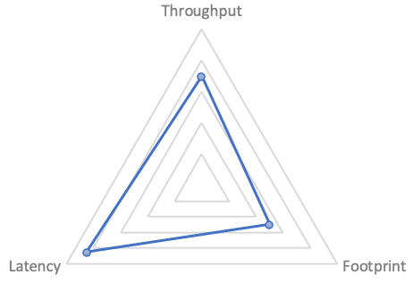
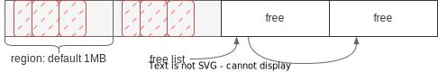
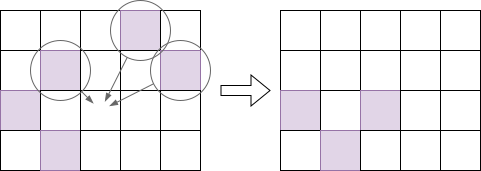

# G1 简介

一个 GC 实现通常需要关注三个方面[^ref-java-gc-evolution]：

- 吞吐(Throughput): 单位时间内能回收的内存，越大越好
- 延时(Latency): GC 里主要关注的是 GC 的停顿，越小越好
- 资源占用(Footprint): GC 需要额外占用的内存、CPU，越小越好

吞吐越高，延时越大；低延时一般需要分阶段并行跑任务，占用更多资源；减小资源占用，
如减少内存则需要更多的时间来换空间。可以用雷达图表示一个 GC 算法的侧重点（示例）：

## 可预测性

> 实时处理很多时候会与“高速性”相关，但是，高速性其实只是实时处理的特征之一。
> 对于实时处理来说，真正重要的特征是“**可预测性**”。[^ref-predictable]

在刚接触 G1 时听到的说法，G1 只需要调一个参数：目标停顿的时间。本质就是设定对
停顿时间的预期。

尽管因为算法实现、程序负载等多方面的因素，G1 的停顿并没有办法 100% 在目标时间
之内，但它内部采用了许多手段来尽力达到“停顿不超过目标时间”这个预期。包括收集并
预测 GC 各个阶段的运行时间、延迟执行 GC、拆分 GC 目标等，来实现“软实时性”
[^ref-soft-real-time]。

从上面的三象限来说的话，G1 是个平衡的算法，从 JDK 9 开始，就成为了 JDK 的默认
GC 算法。JDK 后续版本也引入了一些低延时的算法，如 ZGC、Shenandoah GC，但它们都
牺牲了吞吐，会占用更多 CPU 资源，并且也缺少 G1 这种以“可预测性”为目标做的优化。

## 分成区域实现细粒度回收

通常把内存认为是一个连续的数组，基于分代的 GC (generational GC) 虽然把大片内存
分成了几个部分（如 Eden, Survival, Old 等)，但在每个部分内还是当成一大片内存在
处理。

G1 则不同，它会将内存划分成大小相等的区域(region)。用户可以随意设置区域的大小，
但 G1 总会向上取整到某个 `2^n`。分配内存时，如果某个区域满了，则会通过空闲链
(free list)表找到下一个空闲的区域。使用空闲链表来管理空闲内存这招，其它算法也
一样使用。如下图：

把内存分成区域是实现可预测性的重要手段，分成多个区域后，可以实现“增量 GC”，每
次只回收一部分区域，来控制 GC 的停顿时间。对比 CMS 一次 Full GC 必须回收整个内
存，如果内存较大，停顿时间一定会长，而 G1 可以选择性地回收一部分，分多次停顿。
本质上是把回收的粒度打得更细了。

## 垃圾回收 = 识别 + 回收

下面简单介绍 G1 的整体流程，包含下面两个主要流程：

- concurrent marking（并发标记）。在尽量不暂停 mutator[^ref-mutator] 的前提下
    标记出存活对象[^ref-inverse-selection]，还需要记录每个区域存活对象的数量，
    这个信息 evacuation 时会使用
- evacuation（比较难翻译，有翻译成“迁移”或“转移”的，这里保留英文）。负责将还存
    活的对象复制到其它空闲区域，将待回收的区域重新标记为空闲。

要注意的是，并发标记与 evacuation 是**相互独立**的，就算最新的标记任务做到一半，
evacuation 还是可以利用之前的标记结果做回收的，毕竟 G1 每次回收并不会回收所有
区域。（后续章节会讨论更多细节）

再以一个图来表达 evacuation 的内容：

紫色的是使用中的区域，evacuation 开始时，会从中选择一个或多个区域进行回收。回
收时将区域中的活动对象复制到某个空闲的区域中。注意这个过程也起到了“压缩”
(compact)的作用，所以它不会出现 CMS 出现的碎片化问题。

---

[^ref-java-gc-evolution]: [Java garbage collection: The 10-release evolution from JDK 8 to JDK 18](https://blogs.oracle.com/javamagazine/post/java-garbage-collectors-evolution)

[^ref-predictable]: 摘自中村成洋的《深入 Java 虚拟机》, p3

[^ref-soft-real-time]: “硬实时”指的是如果超出某个时间，会发生严重后果，如手术
  机器人。“软实时”则表示要求虽然很高，但偶尔超出几次也没关系的情况

[^ref-mutator]: 这个词是 Dijkstra 创造的，把它理解成应用程序就行。

[^ref-inverse-selection]: 目标是找出所有的垃圾，但我们做的是反向筛选，找出所有
  “非垃圾”，剩下的就是垃圾了，这个逻辑挺有趣的

[^ref-plumbr]: 引用自 https://plumbr.io/handbook/garbage-collection-in-java
