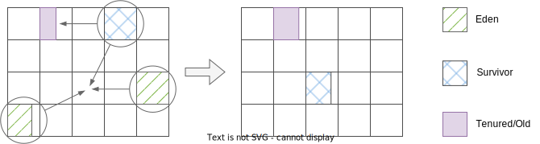
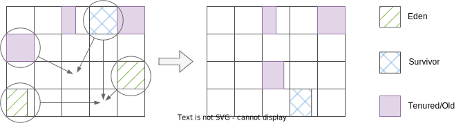

# 分代（Generational） G1 GC

上面几节讨论 G1 GC 虽然偶尔提到分代，但整体还是尽量弱化了分代带来的影响。但其
实 Java 中的 G1 GC，默认就是分代模式。下面介绍分代 G1 GC 带来的区别。

## 分代基础知识

分代 GC 基于这样的[发现/假设](https://plumbr.io/handbook/garbage-collection-in-java#generational-hypothesis)：

* 多数对象一般创建不久后就被废弃了/死了
* 一段时间后还在使用/活着的对象，通常还会继续存在/活（非常）长的时间

从对象存活时间和对象数量的视角来看，分代假设就是这样的（[原图](https://plumbr.io/app/uploads/2015/05/object-age-based-on-GC-generation-generational-hypothesis.png)）：

当然这个假设不一定符合实际，比如 LRU 缓存，越老的对象越可能被淘汰。

## 分代的 G1GC

在分代 G1GC 中，区域会被分成两种，一种是年轻代区域（Young Gen），一种是老年代
区域（Old Gen），分别代表分代里存活短和存活长的对象。而回收也有两种模式：完全
年轻代 GC（Fully Young Collection），部分年轻代 GC（Partially Young Collection）
也称为混合 GC（Mixed GC）。当然还有一种Full GC，指的是当 G1 来不及回收时，退化
成的 Serial 模式。

为什么命名这么奇怪？叫 Mixed GC？这是因为在 G1 中，Young GC 会回收所有的 Young
Gen区域，而 Mixed GC 在回收部分 Old Gen 区域外，也会回收**所有的 Young Gen 区
域**，由于回收混合了 Young Gen 区域和 Old Gen 的区域，所以叫混合 GC。

要注意不管是 Young GC 还是 Mixed GC，所有的 Young Gen 区域都会被回收。

## RSet 忽略 Young Gen

RSet 记录了跨区域的引用，在 evacuation 阶段会被用来寻找非 CSet 的引用。既然所
有 Young Gen 区域都在 CSet 中，那么 RSet 中永远都不需要包含这些区域的 Card。

具体操作上，在 RSet 写屏障执行时[^ref-code-write-barrier-short-path]，会判断如
果引用方在 Young Gen 中，则跳过执行，不将对象加入 DirtyCardQueue。如下图左图，
正常情况下在区域 B 的 RSet 中需要包含对象 `a` 所在的 Card，但因为 `a` 在 Young
Gen 中，因此可以不记录。但反过来，Young Gen 的区域还是需要维护 RSet，记录来自
Old Gen 的引用，如下图右图。

## 动态决定年轻代区域数量

在 G1 evacuation 中，为了保证 STW 时间在用户设定的停顿时间之内，会控制 CSet 中
区域的数量。但是每次 GC 时所有的 Young Gen 区域都会被回收，就会有个问题：有可
能回收这些 Young Gen 区域消耗的时间就已经超过了停顿时间，这时怎么办？

G1 的作法是动态设定 Young Gen 区域的数量，G1 会根据历史的一些 GC 信息来预测回
收一定量的 Young 区域所需的时间，并且在设置数量时都会保证预测的回收时间不大于
预期的停顿时间。不过对 Young GC 和 Mixed GC ，数量设置的策略有所不同。

如果下一次是 Young GC，则 G1 会设置尽可能多的 Young Gen 区域，这样能充分利用内
存。如果下一次是 Mixed GC，则 G1 会设置尽可能少的 Young Gen 区域（G1 会根据如
新增对象速率等信息预测一个下限），这样才能在Mixed GC 时回收更多的 Old Gen 区域。

另外设置 Young Gen 区域数量是在回收结束时完成的
[^comment-when-to-set-young-gen-size]。

## GC 何时切换

什么时候跑 Young GC，什么时候跑 Mixed GC？G1 会在 Concurrent Mark 结束，
Cleanup 的时候，利用标记时统计的区域存活计数信息，计算当前堆上的垃圾占比，如果
比例大于`G1HeapWastePercent=5` 则会启动 Mixed GC[^ref-code-next-mixed-gc]。参
数名直译是“堆浪费百分比”，类比成家里堆的垃圾超过多少就需要深度清洁了。

## G1 中的对象晋升

分代假设里需要有一个概念“存活时间”，以此决定一个对象是在 Young Gen 还是在 Old
Gen，那么 JVM 里是怎么表示的？对象又是怎么在代际中流转的？

JVM 会在对象的 header 中用 4 bit 保存对象存活的年代数，每进行一次 GC 年代数加
一，当对象存活的年代数大于等于 `MaxTenuringThreshold=15` 时会“晋升”进入 Old
Gen。在此之前都会留在 Young Gen 中。Young Gen 也分成两种区域：Eden 与
Survivor。Eden 直译是伊甸园，新增的对象都分配在 Eden 区，而每次 GC 存活但还不
够资格进入Old Gen 的对象，都会被转移到 Survivor 区。逻辑流程如下图
（[原图](https://plumbr.io/app/uploads/2015/05/how-java-garbage-collection-works.png)）：

在 G1 中，堆是切分成区域的，区域不是连续的。从区域的视角看，Young GC 的流程如
下，所有 Young Gen 且只有 Young Gen 被回收，对象根据存活时间可能被复制到新的
Survivor 区域或 Old Gen 区域：

Mixed GC 的流程跟 Young GC 差不多，只是在回收时除了 Young Gen 区域还会回收部分
Old Gen 区域：

## 大对象区域（humongous）

除了 Eden, Survivor, Tenured 区域外，G1 中还有一类特殊的区域：大对象区
（Humongous Region）。所谓的大对象（Humongous Object）是指对象的大小大于或等于
区域的 50%，通常是些数组对象，这些对象会被特殊处理[^ref-humongous-object]：

- 大对象会被分配在 Old Gen 中的一个或多个连续区域且独占这些区域，区域中
  剩余的空间就浪费了
- 通常大对象回收只在并发标记的 Cleanup 阶段或 Full GC 时。但一些基本类型的数组
    （如 int 数组）则可以在任意 GC 停顿中回收
- 创建大对象可能会导致一些 GC 停顿提前开始，G1 在每次大对象创建时都会检查
    IHOP[^ref-ihop] 阈值，阈值超了的话，可能会导致 Initial mark 提前开始
- 大对象永远不会被移动，移动大对象本身也没意义（它不需要 compact 之类的操作）。
  潜在地，大对象区域卡在中间，可能会造成区域空间的碎片化

## 小结

分代是 GC 中的优化，分段假设在 GC 中的地位应该十分重要（没有找相关资源），JDK
后续的一些低延时算法如 Shenandoah GC、ZGC，开始的实现都不包含分代，但后续的版
本都在尝试实现（如[JEP 404](https://openjdk.org/jeps/404) 提出为 Shenandoah 加
上分代，[JDK-8272979](https://bugs.openjdk.org/browse/JDK-8272979) 在 ZGC 中实
现分代）。

---

[^ref-code-write-barrier-short-path]: [G1BarrierSet::write_ref_field_post](https://github.com/openjdk/jdk11u-dev/blob/master/src/hotspot/share/gc/g1/g1BarrierSet.inline.hpp#L51) 中，如果引用方在 Young Gen 中，则直接退出写屏障

[^comment-when-to-set-young-gen-size]: 在《深入 Java 虚拟机》一书里说是在并发
  标记时结束，但看 JDK 11 的调用链的入口应该是在[回收结束时](https://github.com/openjdk/jdk11u-dev/blob/master/src/hotspot/share/gc/g1/g1CollectedHeap.cpp#L3047)

[^ref-code-next-mixed-gc]: [G1Policy::next_gc_should_be_mixed](https://github.com/openjdk/jdk11u-dev/blob/master/src/hotspot/share/gc/g1/g1Policy.cpp#L1084)

[^ref-humongous-object]: [JDK 11 Humongous Objects](https://docs.oracle.com/en/java/javase/11/gctuning/garbage-first-g1-garbage-collector1.html#GUID-D74F3CC7-CC9F-45B5-B03D-510AEEAC2DAC)

[^ref-ihop]: Initiating Heap Occupancy

[^ref-code-young-target]: [G1Policy::young_list_target_lengths](https://github.com/openjdk/jdk11u-dev/blob/master/src/hotspot/share/gc/g1/g1Policy.cpp#L213)
