# 软实时性

本章介绍 G1 如何实现软实时性

## 调参选项

在介绍的时候说过，第一次接触 G1 时听到的说法是 G1 只需要调一个参数：目标停顿的
时间。如果更细地话其实是 3 个：

1. 可用的内存上限
2. 目标停顿时间 `-XX:MaxGCPauseMillis=200`，默认是 200ms
3. 停顿间隔 `-XX:GCPauseIntervalMillis`，默认为 `MaxGCPauseMillis + 1ms`

这三个参数其实是相互制约的。例如用户设定了停顿时间 1s，那如果 JVM 使诈，就可能
停顿 1s，留给 mutator 1ms，再立马停顿 1s。表面看来停顿时间都满足了，但实际因为
停顿太频繁导致 mutator 实际获得的执行时间太少了。

于是停顿间隔 `GCPauseIntervalMillis` 给目标停顿时间加了一个约束，它表示：在时
间轴上**任意**划出一个停顿间隔，里面总的停顿时间不得超过设置的值。这实际上约束
了，JVM 在任意停顿间隔内，需要给 mutator 预留至少 `GCPauseIntervalMillis -
MaxGCPauseMillis` 执行的时间。例如目标停顿是 1s，间隔是 3s，下图里所有的停顿都
是 1s，但间隔 B 里总的停顿时间超过了 1s，就破坏了这个约束。

但这样 JVM 又可以走极端，那我尽可能地把 GC 延迟不就行了，垃圾也不清理了。因此
可用的内存上限又会限制最大可使用的内存，阻止 GC 的无限堆积。如果垃圾实在赶不上
回收，G1 会退化成 Serial 回收器进行回收，此时就会极破坏目标停顿时间。

## 预测 evacuation 时间

为了完成用户设定的目标停顿时间，G1 的手段比较有限，主要有两个：

1. 调整回收工作量以满足目标停顿时间，如调整 CSet 的数量，或者是 Young Gen 的区域数量
2. 延迟回收以满足停顿间隔的要求

不管哪个目标，都需要（尽可能准确）预测回收工作需要消耗多少时间，G1 中使用下面
的公式做预测：

$$
V(cs) = V_{fixed} + U * d + \sum_{r \in cs}(S * rsSize(r) + C * liveBytes(r))
$$

其中：

- \\( V(cs) \\) 代表预测回收 CSet 中所有区域需要的时间
- \\( V_{fixed} \\) 代表固定消耗
- \\( U \\) 代表扫描一张 Card 的平均消耗，\\( d \\) 代表转移开始时脏卡片的数目，
    转移开始时需要扫描所有脏卡片来保证 RSet 信息是最新的
- \\( S \\) 代表扫描一张 RSet 中 Card 的消耗，\\( rsSize(r) \\) 代表区域 `r`
    RSet 中总的 Card 数量
- \\( C \\) 代表回收一个字节(byte)的时间，\\( liveBytes(r) \\) 代表区域 `r` 内
    存活对象的数量

其中 \\( V_{fixed} \\)、\\( U \\)、\\( S \\)、\\( C \\) 这些跟时间相关的参数都
是变化的，跟算法的实现、机器的性能等等都有关系。因此 G1 处理的的方式是启动时先
给个先验的定值，边运行边收集每次回收的相关数据，再根据这些数据动态修正这些变量
的值。

其它的变量如 \\( d \\)、\\( rsSize(r) \\)、\\( liveBytes(r) \\) 这些跟数量相关
的值，在一次具体回收时都可以统计得到。

最后一个变量是 `cs`，代表 CSet。G1 在标记时会按区域的回收效率从高到低排序，在
决定 CSet 时，会依次尝试将新区域加入 CSet，直到加入新区域后，计算得到的 `V(cs)
` 超过了用户设置的目标停顿时间为止，超出停顿时间的新区域会被剔除。

## 可信度

用户可以配置可信度 `-XX:G1ConfidencePercent=50` 代表的是对上述预测的信心。对于
这个值的作用到现在我也还不太理解。从代码层面看它有两个影响：

1. 做各种时间预测时，会计算 `avg + confidence/100 *
   stddev`[^ref-code-time-pred]，信心越大预测出来的值越大
2. 在做空间预测时，会以 `bytes * 100 / confidence` 来预留，即信心越大，多预留
   的空间越小。

第二点容易理解，不理解的是第一点，为什么信心越大，预测出的时间越大？

我觉得“可信度”是失败的设计。这个参数功能上是给调整预测值留了个口子，但它的调整
粒度太粗了。从业务上它映射的“可信度”这个概念是不合理的。用户凭什么来判断可信度
是多少？预测的内容是跟代码和环境相关的，为什么需要用户来设置可信度？

## 暂停的调度

上面提的“预测”解决了单次停顿满足目标停顿时间的要求，在这基础上，还需要通过适当
的调度策略来保证在任意指定时间间隔内的停顿时间不超出目标停顿时间
[^comment-not-optimal]。

G1 在调度上拥有的手段只有一个：延迟停顿任务的执行。所以调度策略要做的，是判断
一个新任务是“现在”执行，还是“等一会”执行，如果要等，等多久。

为了回答这个问题，G1 会维护一个队列，记录最近一段时间的停顿事件，队列的每个元
素就是一个事件，每个事件只记录停顿的开始和结束时间。队列的元素个数是固定的，如
果事件的数量过多，就会抛弃最老的事件。

考虑 G1 预测了下一次停顿时间，调度时会假设这次停顿“立即执行”，就能算出最近一次
间隔的开始时间 `X`。接着就能计算出假设立即执行，在间隔内总的停顿时间。如果时间在允
许的停顿时间内，就立即执行。如果超出了，则会尝试将 `X` 不断后移，直到以 `X` 开
始的区间内总的停顿时间小于预期停顿时间，最后根据这个时间算出需要推迟多久，如下
图：

## 并发标记中的暂停

并发标记也会按上节提到的调度逻辑进行调度，只是并发标记不像 evacuation 那样可以
通过调整工作量来调整停顿时间。并发标记中有这么几项 STW 操作：

- 初始标记 (Initial Mark)。标记 GC Root 能直达的对象
- 最终标记 (Remark)。扫描 SATB 队列信息
- 收尾工作 (Cleanup)。统计存活对象，清理 RSet 等

由于标记的停顿时间没有办法调节，因此如果某个环节本身的时间已经超过了用户设定的
目标停顿时间，那 G1 也无能为力了。

## 小结

G1 的这套机制还是较大的参考价值的：

1. 从交互上允许用户设定目标停顿时间和间隔
2. 手段上把任务拆成更细的粒度（回收区域），并通过控制数量来控制时间
3. 为了决定数量，利用历史统计信息做预测

如果类比的话，项目管理中的排期也大抵是如此，把功能拆成小任务，估算每个任务的时
间，考虑迭代的周期，反过来选择重要的功能和小任务。

---

[^ref-code-time-pred]: JDK 中的对应代码：https://github.com/openjdk/jdk11u-dev/blob/master/src/hotspot/share/gc/g1/g1Predictions.hpp#L58

[^comment-not-optimal]: 以我粗浅的数学知识，感觉 G1 简化了整体的问题难度，先设
  定单次任务停顿尽可能多，再来调度这个任务。但如果同时考虑优化单次任务的任务量
  以及任务调度的时间，可能难度会比较大。
