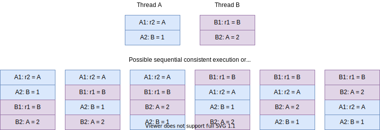

# 都是顺序的错

我们常说并发问题的根源是原子性(Atomicity)、可见性(Visibility)和有序性
(Ordering)。从更宽泛的角度来看，都可以认为是顺序(Ordering)的问题。

## 对顺序的预期

并发问题，或者说线程安全问题的根本原因是我们对编写代码的运行逻辑有某种预期，而
这种预期 JVM 或机器无法满足。我们对代码运行逻辑的预期主要有两个：

1. 写在代码里的操作/语句，前面的比后面的先执行
2. 前面的语句执行完后，后面的语句能看到前面语句的执行结果

例如 Java 代码：

```
// 初始条件 x = 0; y = 0;
1. x = 1;
2. if (x > 0)
3.    y = 2;
```

我们很自然地预期执行的顺序是 `1 > 2 > 3`，写在前面的先执行。同时在 #1 执行后，
我们预期 #2 就能看到结果，于是 #2 的 `if` 判断结果为 `true`。

这是单线程的情况，代码的顺序就是我们预期的执行顺序，那么多线程下呢？我们会有什
么预期？

## Sequential Consistency

在多线程语境下，什么执行顺序才是合理的预期呢？Leslie Lamport 提出了 [Sequential
Consistency](https://www.microsoft.com/en-us/research/uploads/prod/2016/12/How-to-Make-a-Multiprocessor-Computer-That-Correctly-Executes-Multiprocess-Programs.pdf)
（顺序一致性）来更精确地定义我们的合理预期：

> ... the result of any execution is the same as if the operations of all the
> processors were executed in some sequential order, and the operations of
> each individual processor appear in this sequence in the order specified by
> its program.[^sequential-consistency]

原文考虑的是 CPU 多个核的执行顺序，说多核的执行结果，相当于把每个核要执行的操
作排个序，在这个顺序里，要求每个核的操作依旧保持在单核内的相对顺序。例如，下图
中有两个线程 `A` 和 `B`，它们各自要执行两个操作，则符合 Sequential Consistency
的顺序如下所示：



可以看到，这些顺序里，`A1` 永远在 `A2` 之前，`B1` 永远在 `B2` 之前，而 `A` 和
`B` 的相对顺序是没有指定的。换句话说，我们会希望，在并发的情况下，程序在单线程
下执行的顺序依旧保持不变，而在没有人工指定多线程操作的相对顺序（同步）时，我们
对多线程的相对顺序没有预期。

注意的是，Sequential Consistency 其实有一个很强的隐藏假设：上一个操作的结果，
要能被下一个操作感知。这个假设很符合直觉，后面我们会说明，其实底层却很难做到。


[^sequential-consistency]: https://en.wikipedia.org/wiki/Sequential_consistency
