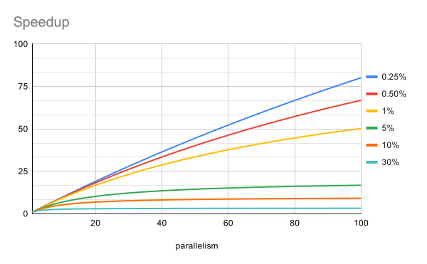
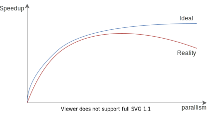

# Amdahl's Law

Amdahl's Law（翻译成阿姆达尔定律）是一个公式，用来衡量并行度增加时，整个系统理
论上的加速比。

## 定律内容

它的出发点很朴素，一个系统中有可以并行执行的部分和只能串行的部分（我们记为`F`
），当系统的并行度增加时，只有可以并行执行的部分才能被加速，于是整个系统的加速
比（并行度增加前的时间/增加后的时间）为：

$$
speedup \le \frac{1}{F + \frac{(1-F)}{N}}
$$

其中 `N` 为并行度，可以理解成有 `N` 个 CPU。公式本身不难理解，分母是 `1` 表示
加速前的时间，分子表示加速后的时间。串行部分 `F` 不受加速影响，保持不变，并行
部分 `1-F` 所需时间变成 `1/N`，因此总和为 `F + (1-F)/N`。

我们画出并行度与加速比在一些串行比例下的关系：

可以看到串行部分的比例极大地影响了加速的效果，例如串行部分占 `10%` 时，并行度
为 100，整体的加速比都不到 `10%`。换句话说你加了 100 个 CPU，换回了不到 10% 的
性能提升。

我们可以从 Amdahl 定律中得到这样的推论：锁的粒度越细，并行度增加对系统的提速越
明显。

## 锁的粒度

从 Amdahl 定律中我们知道，要提高系统理论的加速比，就要减少系统中串行的部分。当
然，所有的性能优化，都应该以测试（Profiling）为基准。不过宏观上，我们知道 Java
中要保证线程安全，是需要通过加锁[^all-locks]来实现的，加了锁的代码能保证是“原
子的”，换句话说，是“串行的”。

因此，从原理上，为了提高 Java 程度的理论加速比，我们需要减少串行的部分，也即减
小锁的粒度。例如加在方法上的 `synchronized` 只加在需要同步的代码块上。

只不过一切都是权衡，为了提升性能，减小锁的粒度，通常代码就会变得更难理解，更难
以维护[^juc]，更容易出错。有时候优化措施会需要打破系统的边界，例如需要在两个子
系统间共享内存等。

因此通常情况下，不要盲目写一些“聪明”的代码（例如能用 `synchronized` 就不要用
`ReentrantLock` 之类的方法），一切以性能测试为基础。

## 增加并行度也有副作用

Amdahl 定律代表的是理论情况，因此理论上即使加速增加不多，增加并行度对整体性能
还是会有提升。不过现实中，可能会是下面这样的曲线：

随着并行度的增加，加速比可能不升反降，这是因为并行度的增加很可能还会增加串行部
分的比例。例如 JUC 中的一些类，尝试获得“锁”时，使用的是 CAS(Compare and Swap)
加上自旋（Spinning）等待的技术。在小并发度时，CAS 通常能很快成功，但在大的并发
度下，CAS 经常性失败，自旋重试导致需要花费比原先更多的时间。

## 小结

Amdahl 定律告诉了我们系统整体可能的加速比受限于系统中的串行部分。在 Java 中，
减少锁的持有时间，减小锁的粒度，都能有效减少系统中的串行部分，代价是代码更难理
解、更难维护、更容易出错。

现实中单纯增加并发度还可能造成额外的性能损耗，因此并不是并行度越高越好。

另外，通常减少串行比例需要结合具体业务才能做到，后面的章节中会介绍利用 JUC 减
小锁粒度的相关内容，但在此之前，我们会回归到 Java 线程，来看看使用线程实现并发
需要付出的代价

---

[^all-locks]: 严格来说，诸如 JUC 原子类的一些线程安全类使用的是 CAS 技术，也被称为“无锁”技术，这里我们不区分这些，统称“锁”。

[^juc]: 还记得之前我们讨论 JUC 包时，说过 JUC 诞生的原因就是 Java 的内置锁不方便细粒度控制吗？
