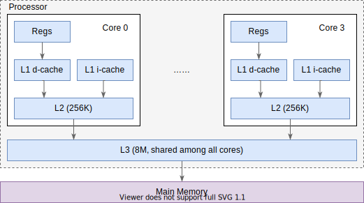

# 残酷的现实

我们常说并发问题的根源是原子性(Atomicity)、可见性(Visibility)与有序性
(Ordering)。它们是祭品，是我们换取极致性能的代价。

本章我们来看看这三个性质是什么，以及破坏它们的缘由。

## 缓存层次结构

在了解三个性质之前，我们先了解一下 CPU 的缓存结构，它对这些性质有很大的影响。

当前 CPU 性能强劲，程序的主要的瓶颈不在计算，而在数据读写。根据 [Latency
Numbers Every Programmer Should
Know](https://colin-scott.github.io/personal_website/research/interactive_latency.html)
里的数据，2020 年，访问 L1 缓存需要 1ns，而访问内存/主存则需要 100ns。因此不管
是硬件还是软件的优化，都在尝试提升缓存的命中率。而破坏原子性、可见性、有序性，
很大程度上也是为了充分利用缓存。

### Core i7 缓存结构

我们来看看 Core i7 的经典三层缓存结构[^cache-hierarchy]（有大概印象就行，不需
要深入理解），如下图：



核内独占 L1, L2 缓存，核间共享 L3 缓存。其中 L1 分为指令高速缓存(i-cache)和数
据高速缓存(d-cache)。

在 CPU 指令需要读取内存时，会先尝试从 L1 缓存中读取，如果发现缓存中没有(称作
cache miss)，则开始从 L2 中读取，依此类推，最终会从内存中读取数据。我们上面说
过，缓存的访问速度与内存的访问速度天差地别，因此很多时候，无论是编译器还是 CPU
都会尽量让运行的代码能充分利用缓存。

在 CPU 需要写入内存时，有两种策略：直写(write-through)和回写(write-back)。直写
会要求把写入的值一路直接写回内存，属于简单粗爆型；而回写则是先写回缓存，等待某
个合适的时机，再将缓存中的所有修改一次性写回内存，性能上会更好。

（要注意的是，现代 CPU 有很多优化，这里的讨论只关心缓存的理论模型，不关心实现
细节）

### 缓存友好的代码

考虑对一个二维数组的遍历，有两种写法：

```
for (int i=0; i<rows; i++) {     | for (int j=0; i<cols; j++) {
    for(int j=0; j<cols; j++) {  |     for(int i=0; j<rows; i++) {
        array[i][j] += 42;       |         array[i][j] += 42;
    }                            |     }
}                                | }
```

哪一种效率更高呢？它们的区别仅仅只在于优先遍历行（左）还是优先遍历列（右）。事
实上左边代码的效率远高于右边的代码，这是因为通常行的数据在内存里是连续排布的，
按行遍历时，该行下一列元素的缓存命中率会比按列遍历时，该列一下个元素的命中率高
很多，这能极大提高程序的效率（可能会高几十倍）。

当然，我们写代码的时候不会也不应该时刻考虑这么细节的优化，大部分情况下这是编译
器和 CPU 要考虑的事。这就引出了影响并发问题的几个关键因素。

## 原子性

原子在物理上是不可分割的粒子[^atomic-induction]，在编程的语境中，[原子性的含义
是](http://www.cs.umd.edu/~pugh/java/memoryModel/CommunityReview.pdf)：

> If an action is (or a set of actions are) atomic, its result must be seen to
> happen "all at once", or indivisibly.

体现在一个或多个操作作为一个整体，执行的结果看起来是“一起”发生的，不被其它的操
作打断或影响。

### 原子性的粒度

你可能已经知道，Java 中的 `++` 操作不是原子的，因为它对应的字节码等价于下面伪
代码：

```
Initial: x = 0;
----------- Thread A --------+--------- Thread B -----------
   x++;                      |    x++;
1. reg0 = value_of_X         |
2. reg0 = reg0 + 1           |
                             | 1. reg0 = value_of_X
                             | 2. reg0 = reg0 + 1
                             | 3. value_of_X = reg0
3. value_of_X = reg0         |
Result:  x = 1               v    x = 1
```

JVM 并不保证这些 3 个字节码作为一个整体是原子的，于是如上述代码所示，在最终结
束后，两个线程都得到 `x=1` 的结果，但预期至少有一个线程应该得到 `x = 2` 的结果
。

这个例子中，我们隐含假设了字节码的执行是原子的，在这种情况下，由多条字段码组成
的 `++` 操作不是原子的。这个结论在各个粒度下都适用：即使 CPU 指令都是原子的，
由它组成的字节码也不一定是原子的；即使字节码都是原子的，由它组成的 Java 操作也
不一定是原子的；即使 Java 操作是原子的，由它组成的 Java 函数也不一定是原子的。

### 上层的原子能力依赖下层

反过来，如果上层的某些操作是原子的，那么它一定需要更底层的原子能力支持。

例如之前章节中提到的 Dekker 算法，它能够从软件层面实现互斥锁，但是它依赖变量读
写操作的原子性。

Java 提供了内置锁(Intrinsic Lock/Monitor Lock) 等语义帮助我们方便地实现多个
Java 操作整体的原子性（可以是一个函数，可以是几行语句），但我们要意识到Java 在
实现这些机制时依赖了操作系统提供的原子能力。

通常操作系统会提供一些原子能力，如 Linux 提供了互斥锁(Mutex)、信号量
(Semaphore)和自旋锁(SpinLock)等锁的语义。而操作系统又依赖一些 CPU 的指令来实现
，如 x86 提供了 [CMPXCHG](https://c9x.me/x86/html/file_module_x86_id_41.html)
指令[^cas] 和 [LOCK](https://c9x.me/x86/html/file_module_x86_id_159.html) 等锁
的语义。

至于 CPU 的锁是如何实现的，就超出了我的知识范围了。

### 为什么不默认原子性？

Java 语言规范规定了读写一个变量是原子操作（除了 long 和 double 型变量），而
long 和 double 型变量只有在声明为 `volatile` 时才是原子的。为什么不让所有操作
都变成原子的呢？

我个人理解有两点（很少看到相关讨论）：

1. 原子性通常意味着独占某些资源，如 CPU 数据总线，使得底层没有优化空间
2. 原子性如果缺少了可见性，通常就没太大用处（如 Sequential Consistency 同时要
   求原子性与可见性），而可见性的实现代价太高了，不适合作为默认选项。

## 可见性

可见性问题可以简单表述为，线程 A 写入某个变量后，线程 B 读取，读到的值会是最新
的值吗？前文提到的 Sequential Consistency 是有这个要求的，JVM 能提供这个保证吗
？

答案是不行。考虑下面的示例：

```java
public class Shared {
    private int count = 0;

    public void write() {
        count = 1;
    }

    public void read() {
        System.out.println(count); // ①
    }
}
```

如果线程 1 先调用 `write` 方法，线程 2 再调用 `read` 方法，此时可能发生如下情
形：


虽然 CPU 1 写入操作成功，但写入的值并没有被 CPU 2 读到[^visibility-caution]。

你可能有疑问，我们在编写单线程的程序时，好像也没有管过可见性问题啊？这是因为操
作系统给我们提供了保证[^visibility-single-thread]：

1. 操作系统会保证单线程的代码在一个核上运行，读写肯定都是这个核的缓存，没有可
   见性问题。
2. 如果线程发生了切换，线程在另一个核上恢复运行，那么操作系统需要做状态的保存
   和还原，保证新核上的缓存反映了之前的修改。

为什么不保证所有操作的可见性？原因可能已经很明显了，就是性能，读写内存对 CPU
来说实在是太慢了，每个读写操作都同步会极大降低性能[^cache-improvement]。

## 有序性

如果说可见性是因为缓存问题客观上被破坏的，那么有序性就是一个主观的破坏行为，主
观上进行重排序来提高程序的性能。程序的重排序一般有两方面：编译器在编译时会对代
码进行重排序；CPU 在执行指令时可能会乱序执行，除此之外Java 使用的 JIT 也对执行
的指令有重排序。而这样做的目的，都是为了提高性能。下面举几个重排序的例子
[^reordering-example]：


1. 这个例子很好理解，省去了无用的赋值。
2. 这个例子是编译器很重要的一个优化，与其在循环内不断更新内存变量 `z`，我们用
   寄存器 `r1` 来临时存储计算结果，循环结束后再更新到内存 `z` 中。
3. 这个例子重新排序了我们的赋值语句，可能上面的代码刚刚访过变量 `z`，因此将对
   `z` 的赋值提前可以充分利用已有的缓存。
4. 这个例子和我们前面小节说的，将一个按列遍历的逻辑替换成按行遍历的逻辑，能提
   高缓存的命中率。

在单线程的程序中，编译器、CPU 总是在做着这些重排序，并且最终的结果“看上去”和不
进行重排序没有区别，为什么到了多线程就到处是坑呢？

这是因为单线程程序的预期运行顺序和代码的编写顺序一样，编译器预先知道了各个操作
的依赖关系，因此可以在不破坏依赖关系的前提下进行重排序，而在多线程的语境下，只
看代码，编译器并没有办法推断出代码的依赖关系，无法知道一个线程里的 write 操作
是不是一定要在另一个线程的 `read`操作前执行，无法合理地做出推断。那要怎么办呢
？

编程语言会提供一些语义(如 Java 中的 `synchronized` `volatile` 等)，程序员需要
在编代码时，显示地指定线程间的执行顺序依赖，这样编译器会保证在重排序时不破坏这
种关系，反之，如果没有指定，编译器就不做任何保证。

## 小结

尽管前面章节中我们定义了 Sequential Consistency，认为在多线程编码中它是符合常
理的预期，但现实世界中，为了程序运行的效率，这些预期无法被满足。

我们先学习了 CPU 的缓存层级结构，了解了缓存的性能优势。之后介绍了原子性、可见
性、有序性这三个引发并发问题的根源。编译器、CPU 打破这三个保证，是为了换取更高
的性能，并且在单线程情况下，也不会对程序的正确性产生影响，是很有价值的权衡。

但是在多线程的语境下，程序的正确性就会受到冲击，因此需要有新的机制来修补这些问
题，下一章我们会介绍 Java 的内存模型。

---

[^cache-hierarchy]: 图来源于《深入理解计算机系统》

[^atomic-induction]: 虽然可能大家都知道，原子也是可分的，但在长时间内，原子是被认为不可分的

[^cas]: CMPXCHG 指令代表的是 CAS(compare and swap) 机制，Java 的 AtomicInteger 和 ReentrantLock 等的实现依赖了 CAS 机制，后续章节会介绍。

[^visibility-caution]: 注意这个示例是理论模型上会发生的，实际上现代的一些 CPU 在缓存之间有诸如 MESI 的同步机制，能保证写入缓存的数据可以被其它核读取，这叫作缓存一致性(cache-coherency)，可以参考[这篇文章](https://software.rajivprab.com/2018/04/29/myths-programmers-believe-about-cpu-caches/)

[^visibility-single-thread]: 参考这个回答 https://stackoverflow.com/a/59159989/826907

[^cache-improvement]: 如上面的注脚提到的，CPU 层面也在尝试优化缓存间的数据同步，如 MESI 协议

[^reordering-example]: 例子取自 [Herb Sutter 的演讲](https://www.youtube.com/watch?v=A8eCGOqgvH4)，[PPT 链接](https://onedrive.live.com/?authkey=%21AMtj%5FEflYn2507c&cid=4E86B0CF20EF15AD&id=4E86B0CF20EF15AD%2124884&parId=4E86B0CF20EF15AD%21180&o=OneUp)
