# Happens Before

前文描述了 Sequential Consistency，它是并发下我们对程序运行顺序的合理预期，也
描述了底层结构为了提升效率，打破了原子性、可见性、顺序性。而之所以在单线程下没
有这些问题，在并发下就会有线程安全的问题，是因为从编写的代码中，编译器无法对线
程间执行顺序的相互依赖做出推断。

本章我们会看到，Java 中提供了哪些机制，让我们人工地指定线程间的相对执行顺序。

## 共享可变状态(Shared Mutable State)

如果两个线程毫无交集，我们还会关心执行的先后顺序吗？谁先谁后都不影响最终的结果
。如果两个线程多次读取了同一个变量，但从来不修改它，执行的先后有关系吗？这种情
况下谁先谁后都不影响最终的结果。

线程安全问题发生的前提是：线程间存在着共享可变状态的行为。

直白地说，同一个变量，有的线程写入，有的线程读取，那么谁先执行谁后执行就会影响
最终的执行结果。

## Java 的多线程原语

说了这么久并发问题，我们还是没有说 Java 的内容，这里先简单提一提 Java 的同步原
语，大家先有个印象。Java 语言提供的同步原语主要有三种：`synchronized` 和
`volatile` 关键字，还有JUC 包中的其它工具，如原子类`AtomicInteger` 等。而语法
层面提供的只有 `synchronized` 和 `volatile`[^final]。

这些高层的原语通常都会起到多个作用，如 synchronized 同时保证了原子性、可见性、
和顺序性，如 volatile 保证了可见性和顺序性。

### synchronized

Java 会为每个对象都生成一个监视器 monitor，可以用来 lock 或 unlock（通常也称为
moniter enter 和 moniter exit），JVM 保证同一时刻只有一个线程能拿到锁。其它获
取锁的线程会被阻塞，直到该锁被释放。另外这个锁是“可重入”的，即一个线程可以获取
锁多次，这种机制有有效减少死锁发生（但注意 Java 不保证检测死锁）。

`synchronized` 语句需要给定一个要上锁的对象，后面跟一个代码块代表临界区，代表
需要同步执行的代码整体。如：

```java
public withdraw(int x) {
    synchronized (account) {
        account.setBalance(account.balance - x);
    }
}
```

也可以直接用来修饰函数：

```java
public synchronized withdraw(int x) {
    this.setBalance(this.balance - x);
}
```

如果不指定“上锁对象”，则默认使用 `this`，如果是静态方法，则默认使用类对象
(Class Object)。

`synchronized` 在执行时，会先拿到上锁对象的引用，然后尝试对该对象的监视器执行
lock 操作，得到锁后开始执行代码块里的操作，代码块执行结束后（不管是正常结束还
是抛异常），会在同样的监视器上执行 unlock 操作释放锁。

这里只提到了锁的“原子性”，下面的 Happens Before 会定义 lock/unlock 的可见性和
顺序性。

### volatile

`volatile` 关键词在语法上比较简单，用来修饰变量：

```java
private volatile balance;
```

直觉上，它说明一个变量是“易变的”，这意味着读写该变量的时候，缓存上的数据都不可
靠，得从内存中读写。这个关键词语义主要关心的是可见性，不过下面的 Happens
Before 除了会定义它的可见性，还会定义它的顺序性语义。

## 跨线程操作

在 [Java 语言规范
](https://docs.oracle.com/javase/specs/jls/se8/html/jls-17.html#jls-17.4.2)里
说明了有哪些跨线程的操作(inter-thread actions)会影响线程安全，为了完整性这里全
文列出：

- Read(normal, non-volatile)，读取一个非 volatile 变量
- Write(normal, non-volatile)，写入一个非 volatile 变量
- 同步操作
    - volatile read: 读取一个 volatile 变量
    - volatile write: 写入一个 volatile 变量
    - lock: 给一个监视器(monitor)上锁
    - unlock: 给一个监视器(monitor)解锁
    - 线程的开始和结束（Java 会生成一个相应的操作）
    - 启动线程和判断线程结束的操作
- 外部操作(External Actions)，与外部世界交互的动作(可以简单理解成 native 方法)
- 线程分散操作(Thread Divergence Action)，导致线程无限循环的操作

对我们来说，通常只关心 (volatile) read/write, lock/unlock。其它操作对于想实现
JVM 的同学们比较重要，对使用者来说，通常它们的行为符合直觉。

## Happens Before

（注：初次看不太懂没关系，但建议后面再复习复习，HB 规则对深刻理解线程安全问题
很有帮助）

Java Memory Model(JMM) 里定义了一些跨线程操作的 Happens Before(HB) 关系
[^partial-order]，并据此来决定线程间一些操作的相对顺序。如果说操作 A "Happens
Before" B，则有两个含义：

1. 可见性：A 的操作对 B 可见
2. 顺序性：A 要在 B 之前执行

我们把 Happens Before 关系记为 `hb(A, B)`，本文也经常记为 `A > B`。

Happens-Before 规则包括[^java-concurrency-book]：

* **程序顺序规则**：如果程序中操作 A 在操作 B 之前，那么在线程中操作 A Happens
    Before 操作 B
* **监视器锁规则**：监视器上的 unlock 操作 Happens Before 同一个监视器的 lock 操作
* **volatile 变量规则**：写入 volatile 变量 Happens Before 读取该变量
* **线程启动规则**：对线程 `Thread.start` 方法的调用 Happens Before 线程内的所有操作
* **线程结束规则**：线程中的任何操作 Happens Before 其它线程中检测到该线程的结
    束操作，要么是调用 `join` 方法成功返回，要么是调用 `Thread.isAlive` 时返回 `false`
* **中断规则**：一个线程在另一个线程上调用 interrupt Happens Before 被中断线程
    检测到 interrupt 调用（通过抛出 InterruptedExceptioin 或调用 isInterrupted
    和 interrupted)
* **finalizer 规则**：对象的构造函数 Happens Before 该对象的 finalizer
* **传递性**：如果 `hb(A, B)` 且 `hb(B, C)`，则 `hb(A, C)`

有了这些规则，加上在代码里使用正确的原语，编译器就能正确地在多线程语境下为我们
的代码排序，如下例中使用了 `synchronized` 在同一对象上同步，如下图[^lock-and-visibility]：



Java 并没有定义两个 lock 操作的先后顺序，这意味着上图中编译器无法确定哪个线程
先进入临界区，但如果如图左边线程先进入，我们就可以通过 unlock 和 lock 的 HB 关
系做出一些推论：

1. 可见性：右边线程在执行时，可以确定 `x = 1`, `y = 1`，因为左边线程 unlock
   前的修改必须可见
2. 顺序性：右边线程对 `i, j` 的赋值不能先于右边线程对 `x, y` 的赋值

两者一起让我们可以推断出，右边线程执行后，结果一定是 `i = 1`, `j = 1`。

## 参考

HB 规则很重要，本身也不复杂，但需要较多的背景知识，这里推荐一些读物

- [JSL Chapter 17](https://docs.oracle.com/javase/specs/jls/se8/html/jls-17.html) Java 语言规范，第 17 章专门讲并发问题
- [深入分析 java 8 编程语言规范：Threads and Locks](https://www.javadoop.com/post/Threads-And-Locks-md) 对上面这篇规范的讲解，对其中一些关键点的分析很不错
- [JSR 133](http://www.cs.umd.edu/~pugh/java/memoryModel/CommunityReview.pdf) 正式和学术的文档，可以先看看其中非学习证明的部分。
- 书《Java 并发编程实战》，不多说了，必看书籍

## 小结

我们的理想是 Sequential Consistency，只可惜由于现实原因 JVM 无法为我们提供这样
的保证，因此我们一直努力寻找多线程下的合理顺序保证。

本章中我们了解了只有“共享可变状态”的情形下，多线程间的先后顺序才会引发线程安全
问题，之后列出了 Java 中的跨线程操作，最后学习了 Happens Before 的（非正式）的
规则，以及 HB 规则如何帮助我们对程序运行结果做出推论。

现在，只要我们能正确地使用这些同步的原语，我们就能写出正确的（符合与 JVM 预期
）的代码了。下一章我们来实战看看一些并发问题，以及如何 HB 关系来解决这些问题。

另外，对于想深入了解的同学，Happens Before 这个保证对于 JVM 而言还是太弱了，所
以 JSR 133 里又提到了 Causality Model（因果模型）。这块对我们使用方来说不重要
，我也不能全看懂，有兴趣的可以看看 JSR 133。

---

[^final]: final 修饰的变量也有一些特殊的语义，本章先不提及，有兴趣的可以参考 JSL 第 17 章

[^lock-and-visibility]: 示例来源于书本《Java 并发编程实战》

[^partial-order]: Happens Before 是一种[偏序关系](https://zh.wikipedia.org/wiki/%E5%81%8F%E5%BA%8F%E5%85%B3%E7%B3%BB)，偏序是集合上的一种关系，满足自反性(`a<=a`)、反对称(`a<=b && b<=a` => `a = b`)、和传递性(`a<=b && b<=c` => `a<=c`)。

[^java-concurrency-book]: 参考《Java 并发编程实战》第 16 章，我觉得它比 JLS 17 章和 JSR 133 中的描述都要清晰
