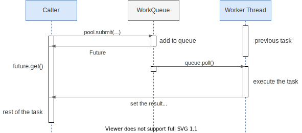
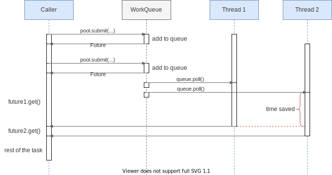

# 线程调度

当我们想要追求极致性能时，有一些调度的知识需要了解

## Future

在使用 `Future` 时，典型的时序图如下：



典型的使用步骤如下：

1. 在 `Caller` 线程中调用 `pool.submit` 将任务提交到线程池
2. 线程池将任务放入任务队列中，并返回 `Future`
3. 在 `Caller` 线程中调用 `Future::get` 方法阻塞等待
4. 当 `Worker` 线程空闲时，从队列中获取任务并执行，执行结束时在 `Future` 中设
   置结果
5. 此时 `Caller` 线程的 `get` 方法返回，获得结果并继续后续的任务

当然通常不会只在调用线程 `Caller` 中阻塞地调用 `Future::get` 方法，不然失去了
使用线程池的意义。一般会在调用线程中提交多个任务，并等待多个 `Future` 执行结束
：



这样就能利用任务的并行来节省调用线程的总时间。但是也要注意使用线程池时的一些损
耗：

* 将任务加入队列需要额外的时间，并发高时消耗会更大
* 等待任务被工作线程执行，也需要额外的时间。如果负载较高，可能会等较长的时间才
    能被执行。

## CompletableFuture

`Future` 使用起来很麻烦：
* `Future` 的结果需要占用线程来检查和使用（阻塞或轮询）
* 不方便回调，如一个 Future 结束时，使用结果触发另一个任务

可以说 `Future` 只是“并行”的产物，没有特别关注“异步”的一些需求。于是在 JDK 1.8
中，参照了 Guava 的 `ListenableFuture` 新增了 `CompletableFuture` 类，用来表达
能主动

例如，如果有两个任务，后者依赖前者，则可以这样使用：

```java
CompletableFuture.supplyAsync(first_task, thread_pool)
    .thenApply(second_task)
    .thenAccept(consumer);
```


