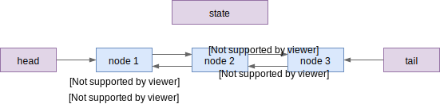

# AbstractQueuedSynchronizer

`AbstractQueuedSynchronizer` 简称 AQS，是一个基于 FIFO 队列的同步器，用于实现
阻塞锁（blocking locks）或其它的同步器（如 Semaphore）。JUC 中的许多锁实现（如
`ReentrantLock`、`ReentrantReadWriteLock`）都依赖 AQS 来实现公平锁或不公平锁。

## 阻塞锁的基本要求

什么是阻塞锁？阻塞指的是抢不到锁的线程进入休眠，直到锁被释放时被唤醒。备选的
方案是自旋（spin），轮询锁的状态并不断尝试抢锁，抢到为止。通常自旋的方式也称为
"active"（主动）模式，休眠模式也称为 "passive" （被动）模式。

为什么需要阻塞锁？原因有两个：一是线程阻塞可以及时释放 CPU 资源；二是阻塞一般
代表会有等待队列，对线程唤醒的顺序能有合理预期（如先进先出）。而自旋锁通常无法
实现。

要如何实现阻塞锁？根据前面的说法，我们需要两样道具：

1. 一个状态，用于标识锁是否被占用
2. 一个队列，等待的线程在队列中排队，等待锁空闲了被唤醒

这也是 AQS 实现的基本结构：

## AQS 的功能

可以说 AQS 的多数操作就是使用 CAS 处理等待队列。不过为了支持更多场景，AQS 实现
了更复杂的功能，主要有两个维度：

- 锁的类型
    - 互斥锁，只有一个线程可以获得锁
    - 共享锁，同时有多个线程可以获得锁
- 获取模式
    - 阻塞获取，不中断（不抛异常）
    - 可中断的阻塞获取
    - 带超时时间的获取

两个维度可以任意组合，得到 6 个 acquire 方法。此外，还有 Condition（条件变量）
的支持。
