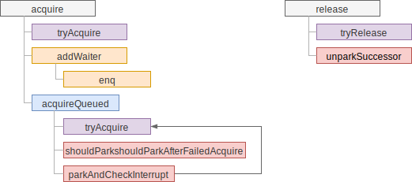
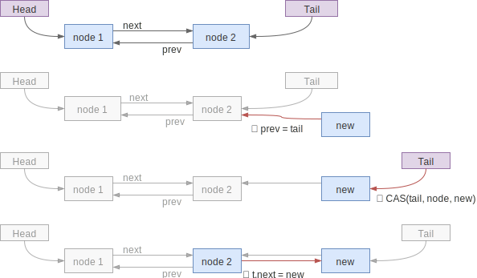
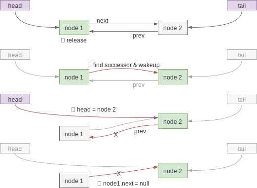

# 互斥锁

互斥锁（exclusive lock）指的是同一时刻只有一个线程能抢到锁，与之相对的是共享锁
，同一时刻有多个线程能抢到锁，如读写锁允许同时有多个读锁。

对于锁的状态，AQS 使用了 `volatile int state;` 这样的定义，对于互斥锁来说，其
实 `boolean` 类型就足够了，`int` 型能应对多数的共享锁。

对锁状态的控制，AQS抽象成了两个方法，由实现方自由实现：分别是 `tryAcquire` 和
`tryRelease` 方法，代表了尝试获取锁和尝试释放锁。尝试获取失败时 AQS 就要考虑如
何将线程加入到队列中了。

AQS 的队列用双向链表实现，抛开花里胡哨的状态管理，最原始的结构如下：

```java
static final class Node {
    volatile Node prev;
    volatile Node next;
    volatile Thread thread;
    //...
}
```

在 AQS 中保留了链表的头和尾：

```java
private transient volatile Node head;
private transient volatile Node tail;
```

AQS 使用的是 FIFO 队列，从 `tail` 入队，从 `head` 出队。约定上，`head` 节点的
后继节点在锁释放时需要被唤醒，唤醒后对应的线程会尝试抢锁，但不一定能成功，在不
公平的抢占下，可能有插队（刚到的还没入队）的线程抢到了锁。

## 调用关系

粗粒度的调用关系如下：



## 入队（enque）

入队的代码如下所示：

```java
private Node enq(final Node node) {
    for (;;) {
        Node t = tail;
        if (t == null) { // ①
            if (compareAndSetHead(new Node()))
                tail = head;
        } else {
            node.prev = t;
            if (compareAndSetTail(t, node)) { // ②
                t.next = node;
                return t;
            }
        }
    }
}
```

代码中 ① 处是为了实现性能优化，如果从始至终都没有竞争，就不需要使用到队列，所
以延迟初始化链表节点节约内存。② 处尝试将新节点加入到队尾，步骤如下图所示：



注意到如果步骤 ③ 完成之前有节点访问了 `node2.next`，会得到 `null`，对于双向链
表来说是有问题的，但是 AQS 对 `next` 指针要求可有可无，因为它的作用只是为当前
节点查找后继，如是 `next == null`，则会从 `tail` 反向查找到 `node2` 的后继，这
在 `unparkSuccessor` 方法中体现：

```java
Node s = node.next;
if (s == null || s.waitStatus > 0) {
    s = null;
    // 反向查找 node 的后继
    for (Node t = tail; t != null && t != node; t = t.prev)
        if (t.waitStatus <= 0)
            s = t;
}
```

AQS 中一般不会直接调用 `enq` 方法，而是调用包装方法 `addWaiter`：

```java
private Node addWaiter(Node mode) {
    Node node = new Node(Thread.currentThread(), mode);
    // 先快速尝试入队，失败时调用 enq，入队逻辑与 enq 中几乎一样
    Node pred = tail;
    if (pred != null) {
        node.prev = pred;
        if (compareAndSetTail(pred, node)) {
            pred.next = node;
            return node;
        }
    }
    enq(node);
    return node;
}
```

## 出队

FIFO 队列，顾名思义是队首的元素先退出。与传统的双向链表操作不同，AQS 节点出队
时并不会释放节点，而是唤醒下一个等待的节点，由被唤醒的线程来释放队首的节点。如
下图：



首先需要在释放锁的时候唤醒 `head` 对应节点的后继节点，即上图中的 `node2`，代码
入口在 `release`，其中 `arg` 参数透传给具体的 `tryRelease` 实现，AQS 不关心。

```java
public final boolean release(int arg) {
    if (tryRelease(arg)) {
        Node h = head;
        if (h != null && h.waitStatus != 0)
            unparkSuccessor(h);
        return true;
    }
    return false;
}
```

其中 `unparkSuccessor` 的实现如下，查到后继节点并唤醒对应线程：

```java
private void unparkSuccessor(Node node) {
    // waitStatus 处理，现在先忽略
    int ws = node.waitStatus;
    if (ws < 0)
        compareAndSetWaitStatus(node, ws, 0);

    // 通过 next 找到后继节点，如果为 null 则由 tail 反向查找
    Node s = node.next;
    if (s == null || s.waitStatus > 0) {
        s = null;
        for (Node t = tail; t != null && t != node; t = t.prev)
            if (t.waitStatus <= 0)
                s = t;
    }
    if (s != null)
        LockSupport.unpark(s.thread); // 唤醒后继节点的线程
}
```

上面代码只是唤醒下一个等待节点，被唤醒线程尝试抢锁并释放 head 节点的逻辑，在抢
锁的方法里。

## 抢锁（acquireQueued）

抢锁的代码入口是 `acquire`，调用 `tryAcquire` 尝试抢锁失败后调用 `addWaiter`
将节点入队，再调用 `acquireQueued` 处理状态的变化：

```java
public final void acquire(int arg) {
    if (!tryAcquire(arg) &&
        acquireQueued(addWaiter(Node.EXCLUSIVE), arg))
        selfInterrupt();
}
```

`acquireQueued` 的实现如下，死循环尝试抢锁直到失败或被中断。成为 head 节点的后
继时会尝试抢锁，成功则成为 head 节点并释放之前的 head 节点，失败则看情况进入休
眠：

```java
final boolean acquireQueued(final Node node, int arg) {
    boolean failed = true;
    try {
        boolean interrupted = false;
        for (;;) { // 重试直到获取锁或被中断
            final Node p = node.predecessor();
            if (p == head && tryAcquire(arg)) { // 当前节点为 head 后继时才尝试获取锁
                // 如上节出队中所说，获得锁后需要释放当前的 head 节点
                setHead(node);
                p.next = null; // help GC
                failed = false;
                return interrupted;
            }

            // 看情况休眠，可能会在锁释放或接收到中断时被唤醒
            if (shouldParkAfterFailedAcquire(p, node) &&
                parkAndCheckInterrupt())
                interrupted = true;
        }
    } finally {
        if (failed)
            cancelAcquire(node); // 失败时需要取消操作，此处先省略
    }
}
```

## 休眠

在 `acquireQueued` 中休眠涉及两个方法：`shouldParkAfterFailedAcquire` 用于检测
当尝试抢锁失败后是否应该休眠，只有当前驱节点的 `waitStatus` 变成了 `SIGNAL` 后
，代表前驱节点释放后会唤醒我们，这才可以安心休眠；另一个方法
`parkAndCheckInterrupt` 是真正执行休眠，被唤醒后检测中断的状态。

`shouldParkAfterFailedAcquire` 的源码如下，其中很多状态管理在共享锁中使用

```java
private static boolean shouldParkAfterFailedAcquire(Node pred, Node node) {
    int ws = pred.waitStatus;
    if (ws == Node.SIGNAL)
        // pred 节点状态正确，锁释放时会唤醒 node，因此可以放心休眠
        return true;
    if (ws > 0) {
        // pred 节点取消了，跳过它找到更前面的节点
        do {
            node.prev = pred = pred.prev;
        } while (pred.waitStatus > 0);
        pred.next = node;
    } else {
        // 在 waitStatus == 0 或 PROPAGATE 的情况下需要将 pred 的状态设置成
        // SIGNAL，保证 pred 释放锁时能唤醒 node 状态改完后 node 需要再次尝试抢锁
        // ，防止 pred 节点还没看到更新后的状态就被释放了
        compareAndSetWaitStatus(pred, ws, Node.SIGNAL);
    }
    return false;
}
```

方法里包含了很多状态管理，但对于互斥锁来说，主要关心 `waitStatus == 0` 和
`waitStatus == SIGNAL` 的情况，其它情况后续介绍的功能中会使用。

`parkAndCheckInterrupt` 实现比较简单，进入休眠，被唤醒时调用
`Thread.interrupted` 检查中断状态。代码如下：

```java
private final boolean parkAndCheckInterrupt() {
    LockSupport.park(this);
    return Thread.interrupted();
}
```
