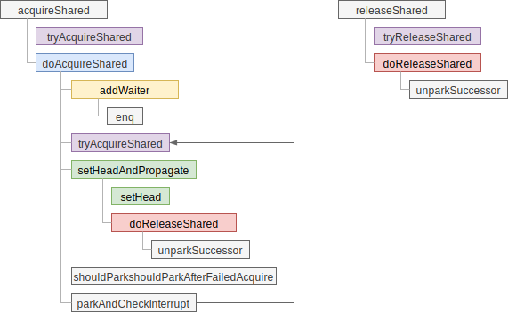
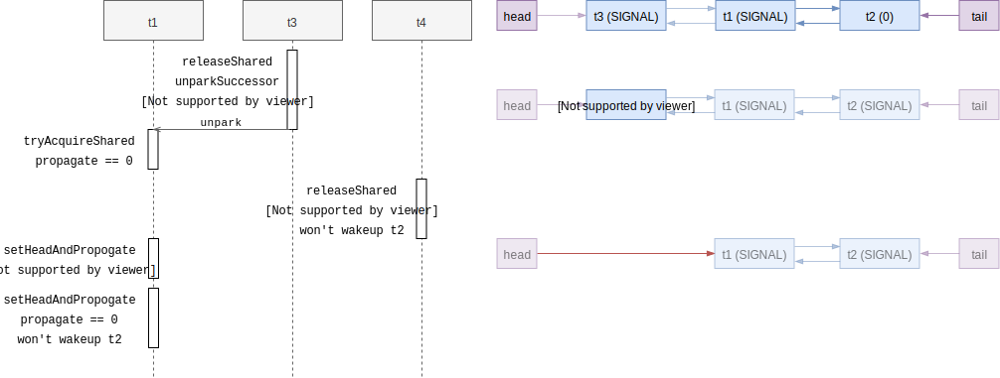

# 共享锁

共享锁与互斥锁的区别在于，共享锁在同一时间能被多个线程持有，不过 AQS 中加锁条
件的判断已经抽象成 `tryAcquireShared` 操作了，由具体的实现类实现。AQS 只负责唤
醒等待共享锁的线程。

为了标识一个节点是在哪种模式（互斥/共享）下工作，`Node` 类需要增加额外的标识：

```java
static final class Node {
    static final Node SHARED = new Node();
    static final Node EXCLUSIVE = null;

    static final int CANCELLED =  1;
    static final int SIGNAL    = -1;
    static final int CONDITION = -2;
    static final int PROPAGATE = -3;


    volatile int waitStatus;
    Node nextWaiter;
    // ...
}
```

当 `nextWaiter` 等于预定义的 `SHARED` 时认为是在共享模式下工作，后续也被用在条
件变量的等待队列中。共享锁模式下节点有多种状态，用 `waitStatus` 存储，跟共享锁
有关的主要有：

- `SIGNAL`，代表后继节点被阻塞了，当前节点释放后需要唤醒后继节点
    * 为了避免竞态条件，抢锁时应先把 prev 节点的状态改成 SIGNAL，尝试抢锁，失
      败时再阻塞
- `PROPAGATE`，只在 head 节点设置，代表有共享锁释放，需要唤醒后续共享节点
- `CANCELLED`，用于取消等待，抢锁出错或线程中断时使用

## 调用关系

粗粒度的调用关系如下：



## 抢共享锁

抢共享锁的操作由 `doAcquireShared` 方法完成，它和互斥锁的 `acquireQueued` 的主
要结构类似：

```java
private void doAcquireShared(int arg) {
    // 创建一个共享模式的节点并加入等待队列
    final Node node = addWaiter(Node.SHARED);
    boolean failed = true;
    try {
        boolean interrupted = false;
        for (;;) {
            final Node p = node.predecessor();
            if (p == head) { // 当前节点为 head 的后继时才尝试抢锁
                int r = tryAcquireShared(arg);
                if (r >= 0) {
                    // 抢锁成功，需要释放 head 节点
                    // 需要看情况唤醒后续的节点，如还有其它可用共享锁
                    setHeadAndPropagate(node, r);
                    p.next = null; // help GC
                    if (interrupted)
                        selfInterrupt();
                    failed = false;
                    return;
                }
            }

            // 看情况休眠，可能会在锁释放或接收到中断时被唤醒
            if (shouldParkAfterFailedAcquire(p, node) &&
                parkAndCheckInterrupt())
                interrupted = true;
        }
    } finally {
        if (failed)
            cancelAcquire(node); // 失败时需要取消操作，此处先省略不谈
    }
}
```

`doAcquireShared` 和 `acquireQueued` 整体逻辑结构判别不大，都是在循环里抢锁，
成功则释放 head 节点，失败则进入休眠。不过有一个区别是是 `doAcquireShared` 使
用了 `tryAcquireShared` 抢共享锁，返回负值代表抢锁失败，正值代表剩余多少锁。

## 唤醒后继节点

在行为上 `doAcquireShared` 与 `acquireQueued` 不同的一点是成功抢锁后，调用的是
`setHeadAndPropagate` 方法，除了释放当前的 head 节点，还会看情况唤醒后续的节点
，这样才能保证多余的锁也能被等待线程抢到。

```java
private void setHeadAndPropagate(Node node, int propagate) {
    Node h = head; // Record old head for check below
    setHead(node);
    if (propagate > 0                                // ① 明确知道还有锁可用
        || h == null || h.waitStatus < 0             // ② 老 head 处于特殊状态
        || (h = head) == null || h.waitStatus < 0) { // ③ 新 head 处于特殊状态
        Node s = node.next;
        if (s == null || s.isShared())               // ④ 后继节点是共享模式
            doReleaseShared();
    }
}
```

`doReleaseShared` 方法用来释放共享锁，在锁释放时也会被调用，它会根据 head 节点
的状态来唤醒后继节点。我们看看 `doReleaseShared` 的具体实现：

```java
private void doReleaseShared() {
    for (;;) {
        Node h = head;
        if (h != null && h != tail) {
            int ws = h.waitStatus;
            if (ws == Node.SIGNAL) {     // ① 正常唤醒后继节点
                if (!compareAndSetWaitStatus(h, Node.SIGNAL, 0)) // 清除 SIGNAL 状态
                    continue;            // CAS 修改状态失败，重试
                unparkSuccessor(h);
            }
            else if (ws == 0 &&          // ② 设置成 PROPAGATE，确保唤醒操作能传播
                     !compareAndSetWaitStatus(h, 0, Node.PROPAGATE))
                continue;                // CAS 修改状态失败，重试
        }
        if (h == head)                   // 如果 head 节点变化了，则继续循环
            break;
    }
}
```

代码 ① 处判断 `head` 节点处于 `SIGNAL` 状态，说明后继节点在等待唤醒，于是调用
`unparkSuccessor` 唤醒节点。② 处则是将节点设置成 `PROPAGATE` 状态后退出。那么
`PROPAGATE` 状态有什么用呢？

## PROPAGATE 状态的作用

跟释放互斥锁一样，释放共享锁时需要唤醒后继的节点，不同的是同一时间可能有
多个共享锁被释放，但唤醒操作只能一个一个进行。需要唤醒多少线程由
`tryAcquireShared` 的返回值指定，且由下一个尝试抢锁的线程在
`setHeadAndPropagate` 方法中通过调用 `doReleaseShared` 执行唤醒操作。

但是被唤醒的线程 T 调用 `tryAcquireShared` 方法得知需要唤醒多少个线程，与执行
唤醒操作之间有延迟，如果这个过程中有其它的锁释放了，则线程 T 执行唤醒时无法知
晓，就会造成逻辑错误。在[早期的实现
](https://github.com/openjdk/jdk/commit/b63d6d68d93ebc34f8b4091a752eba86ff575fc2#diff-a231009cfe9653cf84d38447c04c56dfL659)
中，`setHeadAndPropagate` 并没有 `PROPAGATE` 状态，就会有这个问题。早期实现的
代码如下：

```java
private void setHeadAndPropagate(Node node, int propagate) {
    setHead(node);
    if (propagate > 0 && node.waitStatus != 0) {
        Node s = node.next;
        if (s == null || s.isShared())
            unparkSuccessor(node);
    }
}
```

对应的，
[releaseShared](https://github.com/openjdk/jdk/commit/b63d6d68d93ebc34f8b4091a752eba86ff575fc2#diff-fb9d12ce13e1294839ef2d3c0db53bf9L1047)
方法中也没有 PROPAGATE 的相关判断：

```java
public final boolean releaseShared(int arg) {
    if (tryReleaseShared(arg)) {
        Node h = head;
        if (h != null && h.waitStatus != 0)
            unparkSuccessor(h);
        return true;
    }
    return false;
}
```

在这种实现下，考虑队列中有 `t3(head) -> t1 -> t2(tail)` 三个节点，`t3` 与不在
队列中的 `t4`拥有锁，`t3` 与 `t4` 先后释放锁，则在下面的时序里，`t1` 和 `t4`
都不会尝试唤醒`t2`：



问题时序如下[^ref-propagate-race]：

1. `t3` 锁释放，调用 `releaseShared` 后调用 `unparkSuccessor` 将 `head` 的状态
   置为 `0`
2. `t1` 被唤醒，调用 `tryAcquireShared` 尝试抢锁，返回 `0`，代表无多余的锁
3. `t4` 释放锁，调用 `releaseShared`，读到 `head.waitStatus == 0`（与 #1 中
   head 相同），不满足 `waitStatus != 0` 的条件，不做唤醒操作。
4. `t1` 抢锁成功，调用 `setHeadAndPropagate`，此时 `propagate == 0`，没有多
   余的锁，于是也不做唤醒操作

最终结果是 `t4` 的锁释放了，却不唤醒任何后续节点，锁释放了，却没有线程被唤醒抢
锁。

因此，在 t1 的 `setHeadAndPropagate` 要唤醒后续节点时，不能只依赖 `propagate`
的值，这个值可能是旧的数据。在调用 `tryAcquireShared` 到释放 head 节点这断期间
里释放锁的线程，需要“告知”被唤醒的线程，不管 `propagate` 的值是什么，都要尝试
唤醒后面的线程，因为有新的锁被释放了。这也就是当前的 `setHeadAndPropagate` 逻
辑中复杂的 `if` 条件的来由了。


---

[^ref-propagate-race]: 参考 [AbstractQueuedSynchronizer源码解读](https://www.cnblogs.com/micrari/p/6937995.html)
