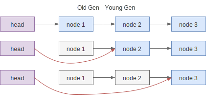

# 取消

当某个线程在抢锁时因为中断、超时等原因出错时，就需要“取消”抢锁。直觉上，取消等
待需要如下操作：

1. 将当前节点从等待队列中移除，这样前驱节点就不会尝试唤醒当前节点了
2. 有必要时唤醒后继节点，例如移除自己的时候前驱节点执行了唤醒操作，而后继节点
   错过了

## 代码实现

AQS 中的取消操作的大致思路类似，代码如下（原代码中的注释也很清晰，建议直接阅读
）：

```java
private void cancelAcquire(Node node) {
    if (node == null)
        return;

    // ① 如果前驱节点尝试唤醒 node，在调用 `LockSupport.unpark` 时会忽略 null
    node.thread = null;

    // ② 查找前驱节点，忽略 CANCELLED 节点（waitStatus > 0 的只有 CANCELLED 状态）
    Node pred = node.prev;
    while (pred.waitStatus > 0)
        node.prev = pred = pred.prev;

    // ③ 记录前驱节点的 next 指针，后续的 CAS 中使用，如果 CAS 失败了，代表同
    // 时有其它修改 next 指针的操作，如其它的取消操作，则不需要做任何其它操作
    Node predNext = pred.next;

    // ④ 这里不需要使用 CAS，本身赋值的操作是原子的
    // 赋值成功前，因为 thread == null，不会受其它线程的影响
    // 赋值成功后，其它节点会忽略当前节点，如 ② 中一样
    node.waitStatus = Node.CANCELLED;

    // ⑤ 当前节点在等待队列的队尾，尝试从队列中移除自己
    // 如果失败则说明有新入队的节点，真正的释放操作在
    // shouldParkAfterFailedAcquire 方法中完成
    if (node == tail && compareAndSetTail(node, pred)) {
        compareAndSetNext(pred, predNext, null);
    } else {
        // ⑥ 如果后继节点需要被唤醒，先尝试设置前驱节点的 next 指针，当前驱执行
        // 唤醒时就能唤醒后继节点。如果失败了则手工唤醒它。
        int ws;
        if (pred != head &&
            ((ws = pred.waitStatus) == Node.SIGNAL ||
             (ws <= 0 && compareAndSetWaitStatus(pred, ws, Node.SIGNAL))) &&
            pred.thread != null) {
            Node next = node.next;
            if (next != null && next.waitStatus <= 0)
                compareAndSetNext(pred, predNext, next);
        } else {
            unparkSuccessor(node);
        }

        node.next = node; // help GC
    }
}
```

## 节点释放

上面的代码中，我们看到只是对节点的 `next` 的指针有操作，而 `pred` 没动过，这意
味着节点还在队列中，那什么时候会被释放呢？在 `shouldParkAfterFailedAcquire` 方
法中：

```java
private static boolean shouldParkAfterFailedAcquire(Node pred, Node node) {
    int ws = pred.waitStatus;
    if (ws == Node.SIGNAL)
        return true;
    if (ws > 0) {
        // 节点休眠前要保证将前驱节点的状态改为 SIGNAL
        // 当前驱节点处于 CANCELLED 状态时，需要跳过节点向前寻找
        // 直到非取消的节点为止（head 节点不可能处于 CANCELLED 状态）
        do {
            node.prev = pred = pred.prev;
        } while (pred.waitStatus > 0);
        pred.next = node;
    } else {
        compareAndSetWaitStatus(pred, ws, Node.SIGNAL);
    }
    return false;
}
```

## 正确性分析（大概）

`cancelAcquire` 的主要流程“显然”是正确的，不过仔细一想又不太明白为什么。这里我
们大致分析一下。

AQS 中的节点能分隔信号，唤醒操作不会跨节点传递，修改前驱的状态也不会跨节点进行
。例如队列 `head -> t1 -> t2 -> t3 <- tail`，前驱节点 `t1` 的操作不会作用到后
继节点 `t3`，反之亦然。前驱节点`t1` 的操作只能是唤醒当前节点 `t2`，后继节点
`t3` 的操作只能是尝试修改 `t2` 的 `next` 指针以及将 `t2` 的状态成 `SIGNAL`，而
无法修改 `t1` 的状态。

而对于将要取消的节点来说，被前置唤醒无关紧要；被后继修改 next 指针，修改状态变
成 `SIGNAL` 也不在意，因为状态修改的主要目的是保证自己能唤醒后继，而这在
`cancelAcquire` 中本来就要处理。

当状态设置成 `CANCELLED` 之后，前驱的操作依旧不会跨越当前节点，但后续的操作可
能忽略取消节点，作用到前驱节点上。但是后继节点（在
`shouldParkAfterFailedAcquire`方法中）跨越 CANCELLED 节点的修改前驱状态，背后
的目的也是让前驱能正常唤醒自己。

于是在取消节点尝试唤醒后继节点时，会首先尝试把要唤醒的后继节点托付给前驱节点，
前提是它的状态符合预期（如状态是 `SIGNAL` ）。而如果前驱节点不符合预期，就直接
唤醒后续节点，后继节点会尝试抢锁，失败后会再自己找到合适的前驱节点。

## help GC

在 AQS 中多次出现设置 next 指针的操作，且注释为 "help GC"，它的作用到底是什么
？

如果一个节点不再被引用，那么 GC 算法是可以正常回收它的，正确性没有问题。问题出
在性能上。如下图，`head` 和 `node 1` 活过一轮 Full GC 被放入老年代中，之
后 `head` 指向了其它节点。



发生 Young GC 时，JVM 会认为 Old Gen 中的对象还活着，于是 `node 2` 在 Young GC
时会被认为存在引用，不被回收。意味着 `node 1` 引用的整条链路，虽然已经没用了，
却只能等 Full GC 才能回收。相反，如果及时将每个节点的 `next` 置为 `null`，则虽
然`node 1` 在 Old Gen 里无法被 Young GC 回收，但其它还在 Young Gen 里的节点能
被回收的，整体上减少了 Full GC 的次数。

已经没用却不被 GC 回收的内存也被称为 Floating Garbage。这个问题在
[StackOverflow 上有描述](https://stackoverflow.com/a/8868973/826907)，指向的
[JDK-6805775](https://bugs.java.com/bugdatabase/view_bug.do?bug_id=6805775) 和
[JDK-6806875](https://bugs.java.com/bugdatabase/view_bug.do?bug_id=6806875) 也
有详细的描述，建议阅读。
