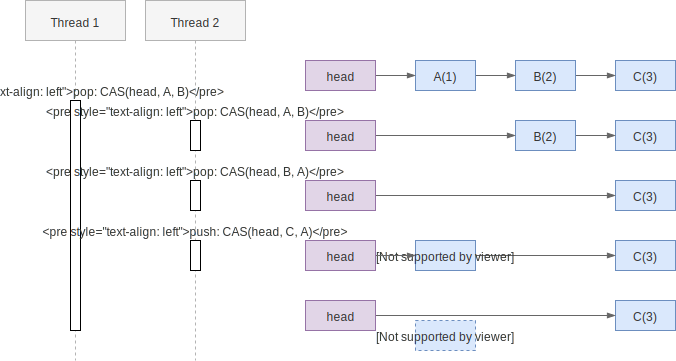

# AtomicStampedReference

`AtomicStampedReference` 本身不难理解，稍微难理解的是它要解决的 ABA 问题。

## ABA 问题

ABA 问题的核心是：CAS 操作在 compare 阶段，只会比较目标的部分信息，例如只比较
内存地址是否相等而非对象的所有字段相等，于是 CAS 时，无法确定目标是最初看到的
那个，还是被其它替换过的。

在非 GC 的语言中（如 C/C++）中实现 lock-free 算法时容易遇到这个问题，因为内存
被释放时可能还有变量存放该内存的引用，而新的对象可能重用了该内存地址，造成地址
相同内容不同的情形[^not-in-java]。

考虑用链表实现一个栈：



上图的问题在于内存地址 `A` 被重复利用，分配给新的对象了。在线程 1 发出 CAS 指
令但还未执行的过程中，线程 2 做了两次 pop，一次 push，最终将 head 的值设置成了
`A(4)`，于是线程 1 的 CAS 判断内存地址还是 `A`，指令执行成功，却把线程 2 push
的元素给 pop 了。

要注意的是这个行为是不是 "bug" 取决于业务的需求，如果业务上单纯是想 pop，那么
逻辑正确，如果业务上线程 1 是想 pop `A(1)`，显然就是错的。在实现 lock-free 算
法时通常这个行为是错的。

另外注意 ABA 问题并不是“原子性”引起的。CAS 的 compare-and-swap 操作依旧是原子
的，只是 compare 的结果不符合上层业务的预期。

解决 ABA 问题的想法也很简单，在 compare 阶段使用更全面的信息做判断，能区分两个
`A` 即可。常见的手段是增加一个额外的字段，记录修改的版本号，也是
`AtomicStampedReference` 的实现方式。

## AtomicStampedReference 成员

代码如下：可以看到定义了 `Pair` 类将原本的 `reference` 和新增的 `stamp` 包装起
来。后面会看到在 CAS 时会用 `Pair` 作为整体用于判断。

```java
public class AtomicStampedReference<V> {

    private static class Pair<T> {
        final T reference;
        final int stamp;
        private Pair(T reference, int stamp) {
            this.reference = reference;
            this.stamp = stamp;
        }
        static <T> Pair<T> of(T reference, int stamp) {
            return new Pair<T>(reference, stamp);
        }
    }

    private volatile Pair<V> pair;
    // ...
}
```

另一个类 `AtomicMarkableReference` 实现几乎相同，只是相比于使用 `int` 型的
`stamp`，它使用了 `boolean` 型的 `mark`。

## CompareAndSet

可以看到 CAS 需要同时判断更新 `reference` 和 `stamp` 两个元素：

```java
public boolean compareAndSet(V   expectedReference,
                             V   newReference,
                             int expectedStamp,
                             int newStamp) {
    Pair<V> current = pair;
    return
        expectedReference == current.reference &&
        expectedStamp == current.stamp &&
        ((newReference == current.reference &&
          newStamp == current.stamp) ||
         casPair(current, Pair.of(newReference, newStamp)));
}
```

只有当 `expectedReference == current.reference && expectedStamp ==
current.stamp` 成立时，我们才认为旧值相同，需要执行 CAS。在执行 CAS 前会先判断
新值是否相同，如果相同已经符合预期，没必要执行 CAS。

在执行 CAS 时，受限于 CAS 操作的粒度，并无法同时判断两个变量，依旧只能判断指针
是否相同。但此时判断的是 `pair` 的指针，而 CAS 前通过其它手段确认 `pair` 的旧
值与用户的预期（入参）相同。

当然，这个方法是“君子协议”，如果大家每次 CAS 都将版本号加一，自然没问题，但如
果有线程刻意去回退版本号，则该方法也无法处理。

## 亮点：包装类实现原子性

我们知道多个变量的原子操作组合后就不再是原子的(TOCTOU 问题）。但是用包装类将多
个两个变量组装，提供组装类的原子操作（相当于一个变量），则可以实现整体的原子性
。

例如下面的代码，业务上希望 `lower <= upper`，虽然 `lower` 与 `upper` 的获取与赋
值都是原子的，但整体的约束可能被打破。

```java
public class NumberRangeService {
  private AtomicInteger lower;
  private AtomicInteger upper;

  public int getLower() { return lower.get(); }
  public int getUpper() { return upper.get(); }
  public void setLower(int lower) { this.lower.set(lower); }
  public void setUpper(int upper) { this.upper.set(upper); }
}
```

可以使用包装类，将约束包装起来，用以实现线程安全，例如：

```java
public class NumberRange {
  private int lower;
  private int upper;

  public NumberRange(int lower, int upper) {
    if (lower > upper) { throw new IllegalArgumentException("lower should be <= upper"); }
    this.lower = lower;
    this.upper = upper;
  }
  public int getLower() { return this.lower; }
  public int getUpper() { return this.upper; }
}

public class NumberRangeService {
  private AtomicReference<NumberRange> range = new AtomicReference<>(new NumberRange(0, 0));

  public NumberRange getRange() {
    NumberRange range = this.range.get();
    return new NumberRange(range.lower, range.upper);
  }

  public void setRange(NumberRange range) {
    this.range.set(range);
  }
}
```

---

[^not-in-java]: 在 Java 中不会发生内存地址重用的问题，因为如果存在对象的引用，
  则对象的内存不会被释放，也不可能被重复利用。
