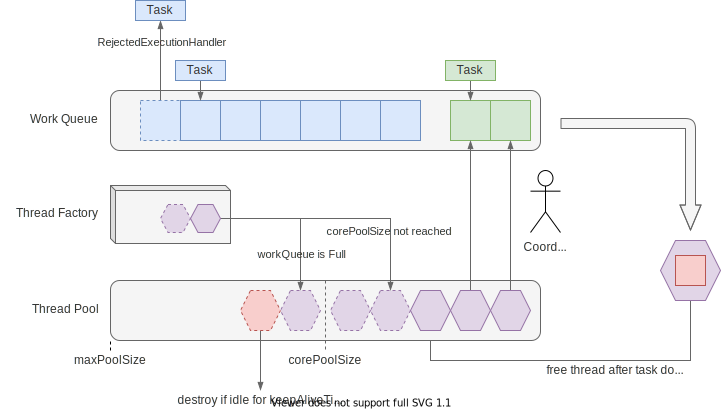

# 预定义线程池

前面的章节中我们介绍了“池化”的思想和基本结构，以及 Java中对线程池操作的抽象概
念，并没有介绍线程池的实现。这个小节中，我们会介绍 JUC 的 `Executors` 类中预定
义的一些线程池实现。

## ThreadPoolExecutor

正确实现线程池的难度是非常大的，Java 中的线程池通常是基于 `ThreadPoolExecutor`
构建的，要么通过构造函数来改变行为，要么通过继承它来扩展行为。我们先来看看它的
构造函数：

```java
public ThreadPoolExecutor(int corePoolSize,
                          int maximumPoolSize,
                          long keepAliveTime,
                          TimeUnit unit,
                          BlockingQueue<Runnable> workQueue,
                          ThreadFactory threadFactory,
                          RejectedExecutionHandler handler) {
    // ...
}
```

我们看到，多数概念跟我们之前提到的“池化”的基本结构是对应的：



各个参数也可以在图中找到直接的对应关系：

1. `corePoolSize`，线程池中线程的保底数量，新来任务时会创建线程，直到达到
   `corePoolSize` 数量
2. `maximumPoolSize`，队列满时，会创建新线程，该参数决定允许创建的最大的线程数
3. `keepAliveTime`，多出保底线程数的线程不用时需要被销毁，该参数表示最大空闲等
   待时间
4. `unit`，等待时间的单位
5. `workQueue`，提交任务的等待队列
6. `threadFactory`，创建新线程时使用的工厂实例，可定制名称，`UncaughtExceptionHandler` 等。
7. `handler`，workQueue 满时，会拒绝新的任务，`handler` 用来决定如何拒绝。

## Executors 工厂类

那么 `Executors` 中提供了哪些预设的线程池呢？

- `newFixedThreadPool`，创建固定线程数的线程池，新任务提交时，线程池会不断
    创建新的线程，直到达到设定的最大值，其后不创建也不销毁线程，如果线程意外退
    出，会再创建新线程直到最大值。

    ```java
    public static ExecutorService newFixedThreadPool(int nThreads) {
        return new ThreadPoolExecutor(nThreads, nThreads,
                                      0L, TimeUnit.MILLISECONDS,
                                      new LinkedBlockingQueue<Runnable>());
    }
    ```
- `newSingleThreadExecutor`，创建只有单个线程的线程池，所以实际上提交到这个线
    程池的任务并不会并发运行。

    ```java
    public static ExecutorService newSingleThreadExecutor() {
        return new FinalizableDelegatedExecutorService
            (new ThreadPoolExecutor(1, 1,
                                    0L, TimeUnit.MILLISECONDS,
                                    new LinkedBlockingQueue<Runnable>()));
    }
    ```
- `newCachedThreadPool`，创建可缓存的线程池，当任务多于当前线程，则会创建新的
    线程用于执行任务，当线程空闲时会被回收，创建的线程数不受限制。

    ```java
    public static ExecutorService newCachedThreadPool() {
        return new ThreadPoolExecutor(0, Integer.MAX_VALUE,
                                      60L, TimeUnit.SECONDS,
                                      new SynchronousQueue<Runnable>());
    }
    ```

除此之外，`Executors` 还提供一些基于其它线程池实现的预设线程池：

- `newScheduledThreadPool`，创建固定大小的线程池，提交的任务可以指定以延迟或定
    时的方式运行，严格来说它返回的是 `ScheduledExecutorService`，虽然这个接口
    也继承了 `ExecutorService`
- `newSingleThreadScheduledExecutor` 与 `newScheduledThreadPool` 类似，只是线
    程池中只有单个线程。
- `newWorkStealingPool` 构造工作窃取队列，是 JDK 1.8 新增的方法，基于 JDK 1.7
  增加的 `ForkJoinPool` 实现，内部会使用多个工作队列来降低对队列的竞争，队列大
  小无上限。

不过，注意到 `Executors` 创建的线程池使用的都是无界的队列，会有潜在过载导致
OOM 的问题，通常建议使用有界队列（但是最好搞清楚它们的差异）。另外，如果使用
Spring 框架，建议使用它的 `TaskExecutor` 抽象，使用 `TaskExecutorBuilder` 创建
线程池，更方便定制。

## 小结

本节主要介绍了 `ThreadPoolExecutor` 的基本结构和参数，并介绍了 `Executors` 提
供的一些预定义的方法。一方面可以直接使用，另一方面也方便了解一些常用的线程池需
求如何实现。

当然，这里只是介绍如何创建，但是创建时要用什么参数就是门学问了，下节会介绍一些
常见的注意事项，更多时候还是需要掌握基本原理，具体问题具体分析。
