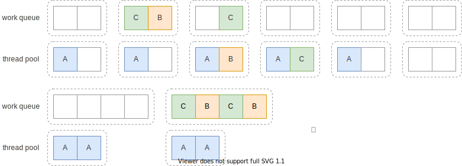

# 线程池使用

上节中我们了解了线程池的一些基本概念，线程池在使用上还有一些需要注意的地方。

## 线程池大小

先上结论：没有标准方法能完美决定线程池的大小，需要测试，具体问题具体分析。

这里摘抄文章[Java线程池实现原理及其在美团业务中的实践](https://tech.meituan.com/2020/04/02/java-pooling-pratice-in-meituan.html)中的调研结果：

|方案|问题|
|---|---|
|$$N_{cpu} = \text{number of CPUs}$$ $$U_{cpu} = \text{target CPU utilization}, 0 \le U_{cpu} \le 1$$ $$\frac{W}{C} = \text{ratio of wait time to compute time}$$ $$N_{threads} = N_{cpu} U_{cpu} (1 + \frac{W}{C})$$| 出自《Java 并发编程实战》，方案偏理论，像线程的计算时间和等待时间很难测算 |
|$$coreSize = 2 N_{cpu}$$ $$maxSize = 25 * N_{cpu}$$ | 没有考虑使用多个线程池的情况，且统一配置明显不符合多样的业务场景 |
|$$coreSize = tps \times time$$ $$maxSize = tps \times time \times (1.7 \text{~} 2) $$ | 考虑了业务场景，但假定流量平均分布，可能不符合实际业务场景 |

可以将上面的公式作为一个经验数值，再根据实际的业务情况来做性能测试来微调。就像
美团的文章里说的，很多时候，流量的压力并不是平均的，实际上也不可能有一套参数能
解决所有问题，还是得具体问题具体分析。

## 有界还是无界

阿里的 Java 规范里有这么一条：

> 【强制】线程池不允许使用 `Executors` 去创建，而是通过 `ThreadPoolExecutor`
> 的方式，这样的处理方式让写的同学更加明确线程池的运行规则，规避资源耗尽的风险

原因是 `Executors` 方法创建出的线程池，全都是**无界**队列，这样的队列会一直接
收任务，直到内存耗尽（OOM）[^backpressure]。如果有界队列满了，
`ThreadPoolExecutor` 默认会抛出 `RejectedExecutionException` 异常。一个常见的
需求是如果队列满了，就阻塞提交任务，可以这么实现：

```java
ExecutorService pool =
    new ThreadPoolExecutor(
        2,  // corePoolSize
        4,  // maximumPoolSize
        60, // keepAliveTime
        TimeUnit.SECONDS,
        new LinkedBlockingQueue<>(10), // ① bounded queue (capacity = 10)
        (r, e) -> {
          try {
            e.getQueue().put(r);       // ② on Rejected, blocking put
          } catch (InterruptedException interruptedException) {
            interruptedException.printStackTrace(); // ③ print and abort on interrupted
          }
        });
```

在 ① 处定义了接收线程池任务的有界队列，大小为 10，当等待任务超过 10 个时，新任
务会在 ② 处调用阻塞的 `put` 方法再次提交到队列中直到队列能容纳新的任务。在 ③
中处理提交被中断时的情形。

阿里的规范里并不要求一定要创建有界队列，很多时候需要具体问题具体分析，不过个人
认为**有界**队列通常是更好的选择，毕竟系统压力大时，本身就处理不了那么多任务，
无界队列不断堆积任务，不仅处理不了，还消耗额外的内存，作用不大。

## 饱和策略

在使用有界队列时，当提交的任务达到了队列的上限，此时应该如何处理？处理的策略就
称作饱和策略（Saturation Policies）。上节中我们自定义了策略：阻塞提交到队列中
。`ThreadPoolExecutor` 提供了一些策略方便使用，它们实现了
`RejectedExecutionHandler`：

* `AbortPolicy`：拒绝新的任务，抛出 `RejectedExecutionException` 异常
* `DiscardPolicy`：默默抛弃新的任务，不抛异常
* `DiscardOldestPolicy`：抛弃队列中最老的未被处理的任务，并尝试重新提交新任务
* `CallerRunsPolicy`：在调用方的线程上运行新任务

`ThreadPoolExecutor` 默认使用 `AbortPolicy`：

```java
private static final RejectedExecutionHandler defaultHandler = new AbortPolicy();
```

## 饥饿死锁

一般死锁的发生都是由于出现了循环依赖，考虑任务 A 依赖了任务 B、C 的结果，假设
A 将任务 B、C 提交到同一个线程池，那么可能发生下面的情形：



问题在于，在 B、C 任务执行完成前，任务 A 所在的线程会一直被占用。如果线程池中
有空闲的线程，则 B、C 任务最终会被执行，从而任务 A 最终完成（图中上面的情况）
。但是如果此时有两个任务 A 占用了线程池，导致提交的 B、C 任务无法执行，此时产
生死锁（图中下面的情况）。

原因是任务 A 依赖 B、C 的结果，而 B、C 又依赖任务 A 退出释放线程资源。

## 只运行独立同构任务

同一个线程池中运行异构的任务，除了上面说的死锁的问题，还可能影响响应时间。

例如有一些时间敏感的任务，和一些时长很长的任务一起提交到线程池中，可能出现大量
线程被时长很长的任务占据，导致时间敏感的任务需要等待很长时间才能被运行，从而导
致响应时间过长。

所以推荐在线程池中只运行同构的任务，同时为了防止死锁，尽量运行独立的任务。

## 扩展 ThreadPoolExecutor

要正确实现一个完整的线程池是非常困难的，很多时候我们只是希望增加某个功能或对现
有功能做微调。一种方式是构造 `ThreadPoolExecutor` 时使用不同的参数；另一种是直
接继承 `ThreadPoolExecutor`。

`ThreadPoolExecutor` 有 3 个 protected 函数可供扩展：

* `beforeExecute`：在任务被执行前执行，可以用来增加一些监控信息。如果方法抛异
    常，则任务不被执行，且相应的 `afterExecute` 不被执行。
* `afterExecute`：在任务执行结束后执行，由任务的执行线程调用。
* `terminated`：线程池中止后执行。可以用来释放线程池分配的资源、记日志等。

注意的是，实现这些方法时，约定上需要调用 `super` 的相应方法。

例如我们希望记录线程池所有线程总的运行时间，可以这样做[^ref-code]：


```java
public static class TimingPool extends ThreadPoolExecutor {
    private final ThreadLocal<Long> startTime = new ThreadLocal<>();
    private final AtomicLong totalTime = new AtomicLong(0);
    private final Logger log = Logger.getLogger("TimingPool");

    public TimingPool(int corePoolSize, int maximumPoolSize, long keepAliveTime,
            TimeUnit unit, BlockingQueue<Runnable> workQueue) {
        super(corePoolSize, maximumPoolSize, keepAliveTime, unit, workQueue);
    }

    @Override
    protected void beforeExecute(Thread t, Runnable r) {
        startTime.set(System.currentTimeMillis());
        super.beforeExecute(t, r);
    }

    @Override
    protected void afterExecute(Runnable r, Throwable t) {
        long elapsed = System.currentTimeMillis() - startTime.get();
        totalTime.addAndGet(elapsed);
        super.afterExecute(r, t);
    }

    @Override
    protected void terminated() {
        log.info("total time(ms) is: " + totalTime.get());
        super.terminated();
    }
}
```

## 小结

线程池只是一把剑，有了剑还得修炼剑法才能成为大侠。本节介绍了使用线程池的一些注
意点，包括线程池大小的确定；队列应该有界还是无界；队列满了该怎么办；极端情况下
的饥饿死锁问题；以及如何扩展线程池的行为。

这些内容只能是算抛砖引玉，希望读者能查阅更多资料，在实际中掌握更多线程池的使用
技巧，也欢迎探讨这里没有涉及的内容。

线程池的使用已经很复杂了，线程的清理可能还更复杂一些，下面的小节中我们会开始介
绍线程的关闭及线程池的关闭。

---

[^backpressure]: 我们希望在消费有压力的时候，能给上游的生产方压力，这也叫做“背
  压”(backpressure)，在线程池里，通过创建有界的队列，在队列满时会抛出异常，能
  及时给上游反馈，希望能减少生产的速率。

[^ref-code]: 修改自《Java 并发编程实战》
