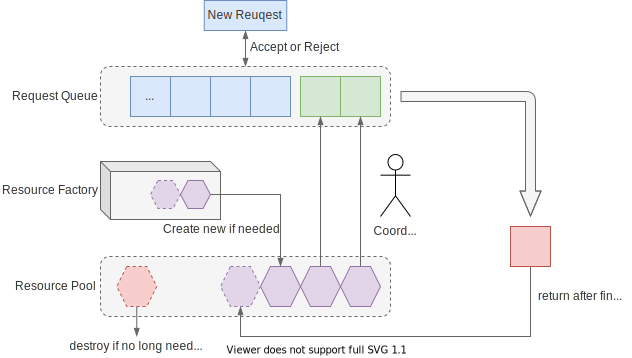

# 线程池

线程池（Thread Pool）主要承载了两方面的需求：

* 减少线程开销，同时避免创建过多线程
* 方便对线程、任务进行管理

线程池的背后是“池化”（
[Pooling](https://en.wikipedia.org/wiki/Pooling_(resource_management))）的思想
。池化的想法是将常用的资源放入一个“池子”中，需要时从池子中申请，结束后返回给池
子，池子里的资源被重复共享利用，能省去许多资源的创建和回收的消耗。同时由于资源
被集中起来，也方便进行统一管理，如创建、分配、回收等。类似的应用还有连接池（
Connection Pool）、内存池（Memory Pool）及对象池（Object Pool）等。

池化的实现整体上需要这样的结构：

如上图，资源池运作需要这样一些角色和过程：

- Request Queue（请求队列）。需要有一个队列来缓冲收到的请求
- 新的请求到来时，根据请求队列是否已满，选择接受或拒绝请求
- Resource Pool（资源池）。需要有一个“池子”来保存资源
- 资源不足时，可能向某个资源工厂申请创建新的资源
- 通常资源池中只保留一定数量的资源，当资源不再需要时，则销毁资源
- Coordinator（协调者）一般会有一个协调的策略，决定如何为请求分配资源
- 当请求的资源使用结束后，会将资源返还给资源池
- 创建和销毁也会有相应的策略

下面我们来看看，Java 中的线程池是如何设计的，和这个基本结构有哪些异同点。
